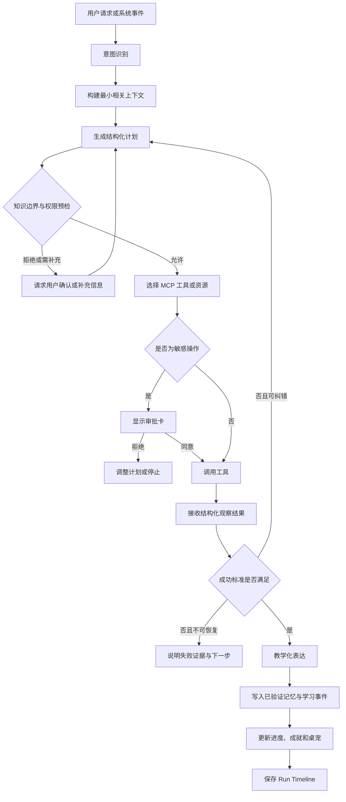
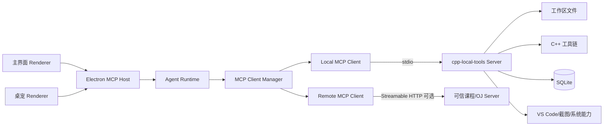
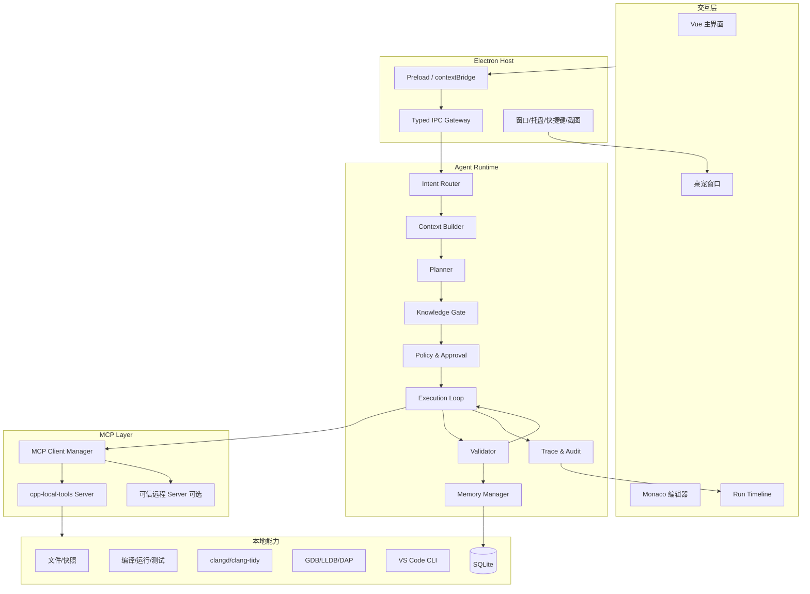
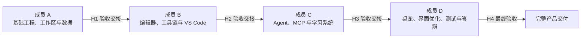

# CppPilot：带桌面宠物的 C++ 学习 Agent 应用开发策划案

## 一、项目基本信息

| 项目项 | 内容 |
|---|---|
| 项目名称 | CppPilot：带桌面宠物的 C++ 学习 Agent |
| 项目类型 | 软件工程课程大作业 / AI Agent 桌面应用 |
| 核心定位 | 通过桌面宠物、代码工作区和教学型 Agent，帮助 C++ 新手完成环境配置、知识学习、代码编写、错误诊断、逻辑纠错与项目实践 |
| 开发人数 | 4 人 |
| 建议周期 | 16 周 |
| 首要平台 | Windows 10 / Windows 11 |
| 主要技术 | Electron、Vue 3、TypeScript、Monaco Editor、Node.js、SQLite、MCP、C++ 工具链、CMake/CTest、clangd/LSP、clang-tidy、GDB/LLDB/DAP、多模态模型 API |
| 交付口径 | 完整、可安装、可持续使用的桌面产品，不以一次性 Demo 或仅能演示的原型作为验收结果 |
| 最终成果 | 安装包、完整源代码、内置课程与题库、接口文档、测试报告、用户手册、项目报告、答辩 PPT 和演示视频 |

本文只讨论课程项目的产品设计、应用开发、团队协作和答辩展示，不包含市场规模、竞品商业模式、成本预算、融资或推广分析。

## 二、产品定义

### 2.1 一句话定义

“CppPilot”是一款带有独立桌面宠物交互入口的 C++ 学习 Agent。它能够理解用户当前项目、代码选区、编译信息、题目要求和知识掌握状态，制定可见的任务计划，调用本地开发工具完成检测、编译、运行、测试、调试和文件操作，再依据工具证据向用户给出不超过其已学知识范围的讲解。

### 2.2 项目背景

C++ 初学者遇到的问题并不只是不理解语法，而是多个环节连续阻塞：

1. 不清楚 VS Code、C/C++ 扩展、编译器和调试器之间的关系。
2. 电脑上可能存在多个 `g++`、`clang++` 或 MSVC 环境，但不知道应该使用哪一个。
3. 能打开代码文件，却不会建立合理的项目结构或管理多个练习文件。
4. 编译器报错信息专业且冗长，难以定位真正的首个错误。
5. 代码能够运行但答案错误时，不会构造反例、观察变量或使用调试器。
6. 通用 AI 容易直接给出超出当前课程进度的代码，用户虽然能提交，却没有真正理解。
7. 学习活动散落在课程网站、IDE、终端、题目页面和聊天工具之间，难以形成连续记录。

本产品将以上环节整合为一条可执行、可验证、可追踪的学习工作流。桌宠负责低门槛交互、跨应用截图和学习反馈；主应用负责工作区、编辑器、知识树、进度与 Agent 运行记录；Agent 负责规划和编排；编译器、调试器、静态分析器、文件系统等工具负责提供事实证据。

### 2.3 产品目标

- 第一次启动时自动发现 VS Code 与本地 C++ 工具链，对候选环境执行真实验证，并在用户确认后绑定。
- 为用户提供受控的项目与文件管理空间，支持手动创建、题目创建、自然语言创建和导入已有项目。
- 同时提供内置 C++ 编辑器和“一键用 VS Code 打开”，避免锁定单一开发习惯。
- 让用户可以针对当前文件、选中代码、编译报错、题目或截图直接询问桌宠。
- 将编译错误、运行时错误和逻辑错误分别交给适合的工具检查，避免只让模型猜测。
- 根据用户勾选和系统验证的知识树状态，限制 Agent 使用的概念、术语与代码写法。
- 建立学习进度、错题、错误类型、成就、等级与桌宠成长之间的确定性联系。
- 提供完整的 Agent 时间线，展示上下文、计划摘要、工具调用、审批、观察结果、验证结论和记忆更新。
- 以四人团队可明确对接和独立验收的方式完成完整产品。

### 2.4 关键名词优化

| 名词 | 本项目中的准确含义 |
|---|---|
| Agent | 由模型、指令、上下文、计划、工具、状态、记忆、权限、验证和运行循环共同组成的任务执行系统，不等同于聊天机器人 |
| Agent Workflow | 从用户触发到意图识别、上下文构建、规划、工具调用、结果验证、教学表达和记忆写入的完整控制流程 |
| MCP | Model Context Protocol，用于让 Host 以统一协议连接工具、资源和提示模板；MCP 是连接层，不等于 Agent 本身 |
| MCP Host | 本项目的 Electron 桌面应用，负责模型、权限、用户界面、Agent Runtime 和 MCP Client 生命周期 |
| MCP Server | 向 Agent 暴露本地或远程能力的服务。本项目主要实现第一方 `cpp-local-tools` 本地 Server |
| 工具链绑定 | 发现候选编译器和调试器，实际验证其可用性，经用户确认后保存为当前或指定工作区配置 |
| 工作区 | 经用户授权、由本应用管理的项目根目录，是文件读写和代码执行的安全边界 |
| 学习画像 | 用户已掌握、正在学习、待复习和未解锁的知识节点，以及学习偏好、错误记录和历史表现 |
| 知识边界 | Agent 生成代码和讲解时允许使用的概念集合，由知识树和确定性策略引擎检查，而不只依赖提示词 |
| 验证与纠错 | Agent 调用编译、测试、静态分析或调试工具验证结论，并在失败时调整计划；答辩中展示证据和结果，不展示模型隐藏思维链 |

## 三、目标用户与学习阶段

### 3.1 目标用户

主要用户为刚开始或正在系统学习 C++ 的大学生，包括课程实验、算法入门和小型项目实践三类场景。用户能够进行基本文件操作，但不一定理解编译、链接、调试、构建系统和 IDE 配置。

### 3.2 学习阶段与典型问题

| 阶段 | 用户状态 | 常见问题 | 产品主要帮助 |
|---|---|---|---|
| 阶段 0：环境准备 | 尚未成功运行第一个程序 | 不知道 VS Code 为什么不能直接运行 C++；电脑里有多个编译器 | 自动探测、烟雾编译、解释候选项、确认绑定、生成环境档案 |
| 阶段 1：语法入门 | 学习输入输出、变量、条件和循环 | 缺分号、变量未声明、括号错误、循环写错 | 编译诊断、错误行定位、中文解释、只使用已学语法给出提示 |
| 阶段 2：数据处理 | 学习数组、字符串、函数 | 越界、初始化、函数参数和返回值错误 | 静态分析、边界测试、变量观察、知识点回补 |
| 阶段 3：解题训练 | 能写出程序但经常答案错误 | 不会构造反例，不理解题目约束和复杂分支 | 题目解析、测试生成、对拍、逻辑证据链和错题复盘 |
| 阶段 4：项目入门 | 开始多文件、类、头文件和 CMake | 文件结构混乱、链接错误、构建配置不一致 | 项目模板、文件管理、编译数据库、符号与依赖分析、VS Code 联动 |
| 阶段 5：独立提升 | 能完成一般练习，希望形成规范 | 代码可读性、测试意识、调试习惯不足 | 代码审查、clang-tidy、学习报告、个性化复习和项目挑战 |

## 四、产品设计原则

1. **证据优先。** 能通过编译器、测试、静态分析、LSP 或调试器确认的问题，不只依赖模型推测。
2. **教学优先。** 默认帮助用户理解和继续完成任务，而不是未经解释地替用户写完代码。
3. **知识有界。** 代码、示例和术语必须经过知识边界检查；需要新知识时先解释并征求用户是否进入学习。
4. **用户可控。** 写文件、删除、覆盖、运行程序、截图和向远程服务发送内容均有清晰权限规则。
5. **本地优先。** 项目、代码、进度和成就默认保存在本地，上传上下文遵循最小化原则。
6. **双入口一致。** 主应用和桌宠共享同一会话、工作区与学习状态，但根据使用场景提供不同界面。
7. **过程可见。** 用户可以看到 Agent 正在读取什么、调用什么工具、得到什么结果以及是否完成验证。
8. **产品完整。** 环境、文件、编辑、Agent、学习、成长、设置、日志、测试和安装卸载均纳入最终交付。

## 五、完整功能规划

### 5.1 首次启动、自动初始化与工具链绑定

首次启动不是简单展示欢迎页，而是一个可恢复的初始化向导。

#### 检测内容

- 检测 VS Code CLI：`code --version`。
- 检测 VS Code 的 C/C++、CMake Tools 等相关扩展，但不把扩展误认为编译器。
- 从 `PATH`、常见 MinGW/MSYS2/LLVM 目录和 Visual Studio Build Tools 中发现 `g++`、`clang++`、`cl.exe`。
- 检测 `gdb`、`lldb`、Visual Studio Debugger、CMake、Ninja 和 Make。
- 读取已导入项目中的 `.vscode/c_cpp_properties.json`、`tasks.json`、`launch.json` 和 CMake 配置，作为候选信息而不是直接信任。
- 使用固定的 Hello World 程序执行“编译 + 运行”烟雾测试，记录退出码、版本、耗时和错误。
- 对 MSVC 使用 `vswhere` 查找带有 `Microsoft.VisualStudio.Component.VC.Tools.x86.x64` 的安装，再调用 `VsDevCmd.bat` 或 `vcvarsall.bat` 获取 `PATH`、`INCLUDE` 和 `LIB` 等环境；不能只调用裸 `cl.exe`。
- 对 GCC、Clang 和 MSVC 分开标记“可编译”“可调试”“可生成编译数据库”三项能力，避免把部分可用误判为完整可用。

#### 绑定流程

1. Agent 调用工具链发现工具，得到候选列表。
2. 按“验证通过、配置完整、与现有项目匹配”等规则给出建议项。
3. 界面展示编译器家族、路径、版本、调试器、构建工具和验证状态。
4. 用户确认全局默认配置，也可以为不同工作区选择不同配置。
5. 系统保存 `ToolchainProfile`，并生成可重复执行的健康检查记录。
6. 设置页支持重新检测、切换、解绑和导出诊断报告。

`ToolchainProfile` 除编译器路径外，还需要保存编译器家族、版本、目标架构、环境初始化脚本、调试器、语言服务器、CMake 生成器、编译数据库位置和最后验证时间。后续启动只做快速复核，配置失效时提示用户重新绑定，不能静默更换工具链。

### 5.2 工作区、项目和文件管理

应用内置“学习工作区”，所有可写工具只能在用户授权的 Root 中工作。

#### 项目建立方式

| 建立方式 | 用户操作 | Agent 行为 |
|---|---|---|
| 手动建立 | 输入项目名、类型和保存位置 | 按模板建立单文件、简单多文件或 CMake 项目 |
| 题目建立 | 粘贴题目或填写输入输出 | 提取题目结构，生成题目档案、样例、测试目录和初始 `.cpp` 文件 |
| 描述建立 | 描述“创建一个学生成绩管理程序”等需求 | 先生成文件树和实现计划，用户确认后调用文件工具创建 |
| 导入已有项目 | 选择本地文件夹 | 建立索引，识别源文件、头文件、CMake、VS Code 配置和工具链需求 |
| 截图或文档建立 | 通过桌宠截取题面，或导入文本/PDF 提取结果 | 用户确认识别内容后创建题目和项目，原图默认不长期保存 |

#### 文件管理功能

- 树状文件浏览、标签页、最近打开、收藏与搜索。
- 新建、重命名、移动、删除和复制文件；高风险操作需要确认。
- 支持 `.cpp`、`.h`、`.hpp`、`.txt`、`.json`、`CMakeLists.txt` 等常用文件。
- 自动保存、手动保存、版本快照、修改对比和一键恢复。
- 文件变更监听：用户在 VS Code 中修改后，应用能检测并刷新。
- 使用内容哈希识别“VS Code 已改动”和“Monaco 存在未保存内容”的冲突，并通过 Monaco Diff Editor 让用户选择保留、合并或重新加载。
- 每个项目保存题目、工具链、运行配置、知识标签、练习记录和最近会话。
- 导出项目压缩包、学习记录或答辩演示包。

### 5.3 内置 C++ 编辑器与 VS Code 联动

内置编辑器使用 Monaco Editor，满足完整学习流程所需的基本开发体验：

- C++ 语法高亮、行号、缩进、括号匹配、查找替换和多标签页。
- 符号大纲、悬停说明、跳转定义、引用查找和基础补全，由 clangd/LSP 提供语义支持。
- 当前行诊断、问题面板、编译输出、运行输入输出和测试结果。
- 工具栏提供编译、运行、停止、测试、调试、格式化、快照和恢复。
- 选中代码后出现“询问桌宠”“解释代码”“检查错误”“生成测试”“加入复习”快捷操作。
- Agent 修改代码时先展示 Diff，用户可以逐块接受、拒绝或要求重新生成。
- 编辑器侧边栏显示 Agent 会话和 Run Timeline，主界面桌宠与侧边栏共享会话。

Monaco 只负责编辑模型、选区、标记、装饰和 Diff，不自带 VS Code C/C++ 扩展能力。应用需要按工作区启动 clangd，将 Monaco 的打开、修改和保存事件映射为 LSP 的 `didOpen`、`didChange` 和 `didSave`，再把诊断、补全、悬停、定义、引用、重命名和 Code Action 映射回 Monaco Provider。LSP、DAP 和 MCP 是三个不同协议，分别解决语言语义、调试器通信和 Agent 工具连接问题。

Monaco Worker 不应直接依赖 `file://` 加载。Electron 应使用受控的自定义安全协议或本地安全资源方案，配合 CSP 和导航限制提供编辑器资源。

VS Code 联动包括：

- 使用 `code -r <path>` 在现有窗口打开项目或文件。
- 使用 `code -g file:line:column` 精确定位诊断位置。
- 用户可设置“默认内置编辑器打开”或“默认 VS Code 打开”。
- 从应用打开 VS Code 后继续监控项目文件变化，Agent 仍可基于最新保存内容工作。
- 不直接操控用户未保存的 VS Code 编辑缓冲区；需要分析时提示用户保存，避免上下文不一致。

### 5.4 桌面宠物与跨应用交互

桌宠是独立于主窗口的 Electron 透明窗口，可常驻桌面，也可以从托盘或全局快捷键唤起。

#### 基础能力

- 透明背景、置顶、拖动、屏幕边缘吸附、多显示器位置记忆。
- 单击展开快捷菜单，双击打开主应用，右键显示托盘式菜单。
- 支持“暂时穿透鼠标”“隐藏一小时”“专注模式”和“开机启动”。
- 气泡展示回答摘要、编译状态、提醒、成就和错误通知。
- 长回答、代码 Diff 和运行时间线自动转到主窗口展示，避免桌宠气泡过载。

#### 桌宠询问方式

- 普通文字聊天。
- 选择当前工作区或文件作为上下文。
- 从内置编辑器选中代码后直接询问。
- 使用全局快捷键启动区域/窗口截图，预览并确认后询问。
- 对终端报错、OJ 结果、网页题面、PPT 或 PDF 中的代码截图进行 OCR/多模态理解。
- 截图默认只在当前请求中临时使用；长期保存必须由用户另行确认。

桌宠采用“可交互”和“整窗点击穿透”两种明确模式，通过 Electron `setIgnoreMouseEvents` 切换，不承诺按透明像素完美穿透。全局快捷键注册后必须检查返回值；若与其他应用冲突，应提示用户重新设置，不能静默失效。

#### 桌宠状态

| 状态 | 含义 | 触发示例 |
|---|---|---|
| `idle` | 待机 | 没有活动任务 |
| `listen` | 等待用户输入 | 展开聊天气泡 |
| `thinking` | Agent 正在规划或生成说明 | 模型请求进行中 |
| `tool-running` | 正在调用本地工具 | 编译、测试、分析或调试 |
| `approval` | 等待用户确认 | 写文件、运行、截图或远程上传 |
| `success` | 验证通过 | 练习通过、错误修复或知识节点掌握 |
| `warning` | 需要注意 | 环境失效、测试失败或知识超界 |
| `level-up` | 成长反馈 | 等级提升或获得关键勋章 |

### 5.5 教学型 Agent 交互

Agent 提供以下工作模式，模式决定计划模板、允许调用的工具和回答方式：

| 模式 | 目标 | 典型输出 |
|---|---|---|
| 环境助手 | 配置和修复本地开发环境 | 候选工具链、验证结果、绑定建议和修复步骤 |
| 概念讲解 | 解释知识点或选中代码 | 使用已学概念的分层讲解、示例和检查问题 |
| 错误诊断 | 处理编译、链接、运行时错误 | 首个根因、相关证据、定位和验证步骤 |
| 解题教练 | 根据题目检查思路和逻辑 | 反例、变量变化、提示阶梯和回归测试结果 |
| 项目助手 | 建立或维护多文件项目 | 文件计划、依赖说明、Diff 和构建验证 |
| 复习教练 | 根据历史记录安排复习 | 错误卡片、知识节点、练习建议和复习结果 |
| 普通聊天 | 回答与当前学习相关的问题 | 简短回答；需要操作时切换到明确的 Agent 任务 |

回答默认采用“指出现象 → 给出证据 → 解释原因 → 提供下一步 → 验证结果”的结构。用户可以选择提示强度：轻提示、分步引导、完整讲解，但任何等级都要遵守知识边界。

### 5.6 编译错误、运行时错误和逻辑错误处理

#### 编译与链接错误

1. 使用当前绑定的编译配置执行构建。
2. 将 `stdout`、`stderr`、退出码和文件位置标准化为 `Diagnostic[]`。
3. 识别首个根因与后续连锁错误，避免一次向新手展示几十条无关信息。
4. 结合 clangd 和 clang-tidy 检查符号、类型、头文件和常见缺陷。
5. 根据知识画像生成中文解释和最小修改建议。
6. 用户接受修改后重新编译验证，并记录是否真正解决。

#### 运行时错误

- 设置运行超时、输出上限和进程回收，防止死循环拖垮应用。
- 识别异常退出、访问冲突、除零、断言失败和输入阻塞。
- 条件允许时使用 AddressSanitizer、UndefinedBehaviorSanitizer 或调试器收集证据。
- 向用户说明“发生位置、触发输入、相关变量和修复后验证结果”。

#### 逻辑错误

逻辑错误必须结合题目，而不是仅审查代码风格：

1. 解析题意、输入范围、输出规则和样例。
2. 将用户代码编译并运行已有测试。
3. 根据约束生成正常、边界、极端和反例测试。
4. 比较预期输出和实际输出，找到最小失败用例。
5. 必要时调用调试工具观察关键变量、分支和循环。
6. 将失败用例映射到相关代码行，形成“题目规则—输入—执行现象—错误位置”的证据链。
7. 先给思路提示；用户要求后再给局部 Diff。
8. 修改后运行原样例、失败用例和回归测试，确认没有引入新问题。

### 5.7 C++ 知识树与知识边界

知识树按“前置关系”组织，而不是简单章节列表。最终交付版本完整覆盖以下域：

- 程序结构、变量、类型、运算符、输入输出。
- 条件、循环、作用域和基本调试。
- 数组、字符串、函数、递归。
- 指针、引用、动态内存。
- 结构体、类、对象、封装、继承和多态。
- STL 容器、迭代器、算法和 Lambda。
- 文件读写、异常、模板、智能指针。
- 多文件、头文件、编译链接、CMake 和基础工程规范。

每个节点包含：

```ts
interface KnowledgeNode {
  conceptId: string
  title: string
  prerequisites: string[]
  level: number
  status: 'unknown' | 'learning' | 'self-claimed' | 'verified' | 'review'
  examples: string[]
  assessmentIds: string[]
}
```

#### 约束机制

- 用户可以勾选“我已经学过”，状态记为 `self-claimed`。
- 通过对应练习、解释检查题或独立修复后，可转为 `verified`。
- Agent 每次生成代码时同时返回 `conceptIdsUsed`。
- 确定性的 `Knowledge Gate` 将 `conceptIdsUsed` 与允许集合比较。
- 如果出现未学知识，系统先要求 Agent 改写为已掌握方案。
- 如果任务无法在现有知识范围内完成，系统说明缺失节点和前置关系，由用户决定是否开始学习，不直接越级输出。
- 回答中出现的术语也要映射到知识节点，避免代码未越界但讲解严重越级。

### 5.8 学习进度、错题复习与个性化计划

- 记录知识节点状态、练习次数、独立完成度、提示使用量和错误类型。
- 自动生成“今日学习”“待复习错误”“推荐下一节点”和“本周项目任务”。
- 建立错误本：保存错误类型、触发代码、解释、修复方式和再次出现次数。
- 根据历史错误安排间隔复习，重复出现的错误优先进入练习计划。
- 为每个练习保存代码演变和关键快照，方便回顾“错误是怎样修好的”。
- 生成个人学习报告：知识树覆盖、题目通过率、常见错误、调试工具使用、独立完成比例和学习时长。
- 支持导出 Markdown/PDF 形式的个人报告，但不建立商业化教师后台。

### 5.9 等级、成就、勋章与桌宠成长

奖励由确定性事件引擎计算，Agent 只负责解释和庆祝，不能任意发放经验值。

#### 经验事件示例

| 事件 | 条件 | 奖励示例 |
|---|---|---|
| 首次绑定环境 | 工具链烟雾测试通过并确认绑定 | 20 XP、“环境搭建者”勋章 |
| 首次独立编译成功 | 未使用完整代码生成且构建通过 | 15 XP |
| 首次修复编译错误 | 修复前后均有工具验证记录 | 20 XP、“除错新手”勋章 |
| 找到逻辑反例 | 生成或手动提供能暴露错误的测试 | 25 XP |
| 掌握知识节点 | 节点从学习中转为已验证 | 10 至 30 XP |
| 连续学习 | 当日完成有效学习行为 | 连续天数与阶段勋章 |
| 完成小项目 | 项目验收测试全部通过 | 50 XP 和项目徽章 |

#### 桌宠成长

- 等级阈值决定桌宠外观阶段、待机动作和气泡主题。
- 勋章展示在桌宠资料页和学习报告中。
- 用户可以关闭成长动画、提醒和连续学习压力提示。
- 不以单纯聊天次数、模型调用次数或重复运行代码刷经验。

### 5.10 联网调研后补充的完整功能

| 功能 | 作用 | 采用依据 |
|---|---|---|
| clangd 语义服务 | 提供符号、定义、引用和准确上下文；通过 `compile_commands.json` 理解真实编译参数 | clangd 官方编译数据库设计 |
| clang-tidy 静态分析 | 检查潜在缺陷、现代 C++ 用法和可修复项 | LLVM 官方 clang-tidy 文档 |
| DAP 调试适配 | 用统一协议连接 GDB、LLDB 或其他调试器 | Microsoft Debug Adapter Protocol |
| CMake Presets 与 File API | 共享构建配置并读取目标、源码和产物信息 | CMake 官方 Presets 与 File API |
| CTest 回归测试 | 将样例、边界输入和回归测试纳入统一测试流程 | CTest 官方能力 |
| clang-format | 提供显式或保存时格式化，并以 Diff 方式展示大范围修改 | LLVM 官方 clang-format |
| Agent 进度与取消 | 编译、批量测试和长任务显示进度，允许用户停止 | MCP 进度通知与取消思想 |
| Prompt 模板库 | 将解释选区、分析错误、检查题目逻辑等交互定义为可复用模板 | MCP Prompts |
| Resource 上下文 | 以 URI 形式暴露题目、代码、诊断、知识状态和会话选区 | MCP Resources |
| 工作区信任 | 未信任导入项目只能浏览，运行和自动写入前必须授权 | VS Code Workspace Trust 的安全原则 |
| 代码快照与回滚 | Agent 修改前创建快照，用户可比较和恢复 | 降低自动修改风险 |
| 反例与测试生成 | 逻辑错误先寻找最小失败输入，再解释错误 | 提高结论可验证性 |
| 学习 Run Timeline | 显示 Agent 计划摘要、工具、结果、审批和验证 | 证明产品具有可审计 Agent 工作流 |
| 外部 MCP 扩展 | 高级用户可接入经批准的课程资料或校内 OJ Server | MCP 标准扩展能力；默认关闭第三方接入 |
| 离线降级 | 无模型网络时仍支持环境检测、编译运行、规则诊断、知识树和进度 | 保证基础学习功能连续可用 |

## 六、Agent 必须成分

### 6.1 Agent 组件总表

| 组件 | 职责 | 输入 | 输出 |
|---|---|---|---|
| Interaction Layer | 接收主界面、编辑器、桌宠、截图和快捷操作 | 用户请求、选区、截图 | 标准化 `AgentRequest` |
| Intent Router | 判断环境、解释、诊断、解题、项目、复习或聊天意图 | 请求与当前状态 | 意图、置信度、推荐工作流 |
| Context Builder | 组装最少且相关的上下文 | 文件、题目、选区、诊断、知识画像、记忆 | `ContextPacket` |
| Planner | 生成结构化步骤、工具需求、审批点、成功标准和停止条件 | 意图与上下文 | `AgentPlan` |
| Knowledge Gate | 检查计划、代码和讲解是否超出知识边界 | 计划、概念标签、学习画像 | 允许、改写或请求学习新节点 |
| Policy & Approval | 校验工作区 Root、工具风险、数据外发和用户授权 | 工具调用请求 | 自动通过、请求确认或拒绝 |
| Model Gateway | 统一模型调用、流式输出、超时、重试和多模态请求 | 提示、上下文、工具描述 | 文本、结构化计划和工具调用 |
| MCP Client Manager | 为每个 MCP Server 建立专用 Client/Session，管理能力协商 | Server 配置 | Tools、Resources、Prompts 与调用结果 |
| Tool Registry | 对工具 Schema、风险、超时和所有者进行登记 | MCP 工具列表 | 可供当前任务使用的工具集合 |
| Execution Loop | 执行“计划—工具—观察—下一步”循环 | 计划与工具结果 | 阶段结果、异常或完成状态 |
| Validator | 重新编译、测试、静态分析或比较结果，验证 Agent 结论 | 工具结果、预期条件 | 通过、失败、需要纠错 |
| Memory Manager | 管理会话状态和长期学习记录，只写入已验证事实 | 结果、用户确认、学习事件 | 会话摘要、学习画像更新 |
| Trace & Audit | 保存计划摘要、工具参数、审批、耗时、结果和错误 | Agent 全流程事件 | Run Timeline、调试日志、答辩证据 |
| Event Bus | 将编译、学习、成就和 Agent 状态发送给 UI 与桌宠 | 领域事件 | 页面更新、桌宠状态、通知 |

### 6.2 Agent 通用运行循环



执行循环必须限制最大步骤数、工具重试次数和总耗时。协议错误、越权、用户拒绝和不可重试错误不能被 Agent 无限重试。

## 七、MCP 设计

### 7.1 MCP 拓扑



Electron 应用是 MCP Host。每个 Server 对应一个独立 MCP Client 和状态化会话。规划、记忆、知识约束和验证属于 Agent Runtime，不应错误写成 MCP 原生能力。

### 7.2 MCP Primitives 映射

| MCP 能力 | 项目用途 |
|---|---|
| Tools | 检测工具链、编译、运行、测试、调试、分析、文件修改、VS Code 打开和截图 |
| Resources | 当前文件、题目、最近诊断、项目结构、代码选区、知识树和学习状态 |
| Prompts | 解释选中代码、分析编译错误、检查逻辑、生成练习、复习错误等用户可选模板 |
| Roots | 用户授权的工作区根目录，用于限制 MCP Server 可访问范围 |
| Logging | 本地工具服务的结构化日志与错误信息 |
| Progress | 编译、索引和批量测试的进度通知 |
| Cancellation | 用户停止编译、运行、调试或 Agent 任务 |
| Elicitation | 在缺少项目名、编译器选择等非敏感输入时请求用户补充，可作为后续增强 |

MCP Tasks 在当前规范中仍属于实验能力，本产品核心流程使用应用自身任务队列、Progress 和 Cancellation，不将完整交付依赖于实验特性。

### 7.3 第一方 MCP Server 工具目录

| 工具名 | 功能 | 风险级别 | 默认审批 |
|---|---|---:|---|
| `toolchain.detect_compilers` | 扫描编译器、调试器、构建工具和 VS Code | L0 | 自动 |
| `toolchain.probe_compiler` | 执行版本检测与烟雾编译 | L1 | 初始化向导统一确认 |
| `toolchain.bind_compiler` | 保存选定工具链 | L2 | 必须确认 |
| `workspace.list_files` | 列出授权工作区文件 | L0 | 自动 |
| `workspace.read_file` | 读取工作区文本文件 | L0 | 自动并显示上下文来源 |
| `workspace.create_file` | 创建文件 | L2 | 展示路径和内容预览 |
| `workspace.apply_patch` | 修改一个或多个文件 | L2 | 展示 Diff 后确认 |
| `workspace.rename_file` | 重命名或移动文件 | L2 | 必须确认 |
| `workspace.delete_file` | 删除文件 | L3 | 二次确认并先建立快照 |
| `workspace.create_snapshot` | 建立代码快照 | L1 | 自动 |
| `workspace.restore_snapshot` | 恢复代码快照 | L2 | 展示差异后确认 |
| `compiler.build` | 编译当前文件或项目 | L1 | 受信任工作区可自动 |
| `program.run` | 运行用户程序 | L2 | 首次或配置变化后确认 |
| `tests.generate_cases` | 根据题目提出测试用例 | L0 | 自动，生成结果需验证 |
| `tests.run_cases` | 批量执行测试并比较输出 | L2 | 受信任工作区可按会话授权 |
| `diagnostics.parse` | 标准化编译和运行诊断 | L0 | 自动 |
| `analysis.clang_tidy` | 执行静态分析 | L1 | 自动 |
| `analysis.symbols` | 读取 clangd 符号和引用 | L0 | 自动 |
| `debug.start` | 启动调试会话 | L2 | 必须确认 |
| `debug.command` | 继续、单步、读取栈和变量 | L1 | 已批准会话内自动 |
| `debug.stop` | 停止调试会话 | L0 | 自动 |
| `problem.parse` | 解析题目结构 | L0 | 自动 |
| `problem.check_solution` | 将代码行为与题目规则对照 | L1 | 自动 |
| `vscode.open_file` | 用 VS Code 打开项目、文件或行号 | L1 | 用户主动触发时自动 |
| `desktop.capture_selection` | 截取用户选择的屏幕区域或窗口 | L3 | 每次明确确认并预览 |
| `learning.get_state` | 读取知识与学习状态 | L0 | 自动 |
| `learning.update_state` | 更新用户确认或验证后的状态 | L2 | 显示更新内容 |

风险定义：L0 为只读；L1 为受限本地操作；L2 为写入、执行或持久状态变化；L3 为删除、截图或远程数据共享等高敏感操作。

### 7.4 MCP Resources 与 Prompts

建议资源 URI：

```text
cpplearn://project/{projectId}/tree
cpplearn://project/{projectId}/files/{relativePath}
cpplearn://project/{projectId}/problem
cpplearn://project/{projectId}/diagnostics/latest
cpplearn://project/{projectId}/run/latest
cpplearn://learner/{userId}/knowledge-state
cpplearn://learner/{userId}/error-book
cpplearn://session/{sessionId}/selection
cpplearn://session/{sessionId}/screenshot
```

内置 Prompt 模板：

- `explain_selection_with_known_concepts`
- `diagnose_compile_error`
- `find_logic_error_from_problem`
- `generate_progressive_hint`
- `review_code_without_rewriting`
- `create_project_plan`
- `generate_practice_for_error`
- `summarize_learning_session`

### 7.5 工具统一返回格式

```ts
interface ToolResult<T = unknown> {
  ok: boolean
  exitCode: number | null
  summary: string
  structuredContent?: T
  diagnostics: Diagnostic[]
  artifacts: ArtifactRef[]
  sideEffects: SideEffect[]
  retryable: boolean
  errorCode?: string
  durationMs: number
}
```

所有工具都必须返回结构化错误，不允许把异常堆栈直接泄漏到用户界面。模型得到工具结果前，Host 需要验证 Schema、裁剪过长输出并标记不可信文本。

## 八、核心 Agent 工作流

### 8.1 首次启动与环境绑定工作流

```text
触发初始化
→ 检测 VS Code 与候选工具链
→ 对候选编译器执行版本探测和烟雾编译
→ 生成推荐排序及解释
→ 用户确认绑定
→ 保存 ToolchainProfile
→ 创建第一个示例项目
→ 编译运行验证
→ 写入“环境已就绪”记忆和成就事件
```

使用组件：Intent Router、Planner、MCP Tools、Approval Manager、Validator、Memory、Achievement Engine。

### 8.2 描述或题目创建项目工作流

```text
用户描述需求或提供题目
→ problem.parse 提取结构
→ Knowledge Gate 检查实现范围
→ Agent 生成文件树、知识点和验证计划
→ 用户确认项目计划
→ 创建快照与工作区文件
→ 编译初始骨架
→ 打开内置编辑器或 VS Code
```

Agent 只能在计划确认后创建文件。若需要未学概念，先提示相关知识节点，不直接生成超界项目代码。

### 8.3 选中代码询问工作流

```text
用户选中代码并点击“询问桌宠”
→ 读取选区、相邻函数、符号定义和题目
→ 加载学习画像
→ 判断用户是在问含义、错误、优化还是改写
→ 选择对应 Prompt
→ 必要时调用符号、编译或静态分析工具
→ 按已学知识输出解释
→ 用户可将解释加入笔记或生成练习
```

选区是主要上下文，Agent 不应无条件上传整个项目。

### 8.4 编译或链接错误工作流

```text
用户点击编译或错误事件触发
→ compiler.build
→ diagnostics.parse
→ analysis.symbols / analysis.clang_tidy
→ 找出首个根因和连锁错误
→ Knowledge Gate 调整讲解
→ 给出轻提示或 Diff
→ 用户批准修改
→ workspace.apply_patch
→ 重新编译验证
→ 写入错误本和学习事件
```

### 8.5 根据题目检查逻辑错误工作流

```text
题目 + 当前代码 + 已有样例
→ problem.parse
→ compiler.build
→ tests.run_cases
→ tests.generate_cases
→ 运行边界与反例测试
→ 必要时启动调试并读取变量
→ 构造最小失败证据链
→ 给出分步提示
→ 用户批准局部修改
→ 全量回归测试
→ 仅在验证通过后记录“已解决”
```

如果无法确认预期输出或题目描述不完整，Agent 必须说明证据不足并要求用户补充，不能把猜测说成确定结论。

### 8.6 桌宠截图询问工作流

```text
用户点击截图或全局快捷键
→ 显示屏幕/窗口选择器
→ 用户框选并预览
→ 脱敏提示与上传范围确认
→ OCR/多模态识别
→ 用户确认识别出的代码或题目
→ Agent 结合可选工作区上下文回答
→ 临时截图在会话结束后清理
```

### 8.7 知识进度与成就工作流

```text
用户勾选节点或完成学习行为
→ 更新节点为 self-claimed 或 verified
→ 重新计算允许概念集合
→ 生成下一步学习建议
→ 领域事件进入 Achievement Engine
→ 确定性规则计算 XP、等级和勋章
→ PetEvent 驱动桌宠成长反馈
→ 记录到学习报告
```

## 九、系统总体架构



### 9.1 进程边界

- Renderer 只负责显示和用户交互，不直接使用 Node 高权限 API。
- Preload 通过 `contextBridge` 暴露经过类型约束的最小 API。
- Electron Main Process 负责窗口、托盘、快捷键、文件选择、截图权限和 IPC 校验。
- Agent Runtime 建议运行在 Utility Process 或独立 Node Worker，避免模型和工具任务阻塞 UI。
- 第一方 MCP Server 使用 stdio 与 Host 通信，集中实现本地工具域。
- 用户 C++ 程序在独立受限子进程中运行；Electron Renderer Sandbox 不能代替代码执行沙箱。

## 十、技术选型

| 层次 | 技术 | 用途 |
|---|---|---|
| 桌面框架 | Electron | 主窗口、透明桌宠、托盘、全局快捷键、屏幕捕获和 Windows 打包 |
| 前端 | Vue 3 + TypeScript + Vite | 主应用、桌宠界面和类型化组件开发 |
| UI | Element Plus + 自建 Design Tokens | 基础控件与统一视觉系统 |
| 编辑器 | Monaco Editor | C++ 代码编辑、选区操作、Diff 和诊断标记 |
| 状态管理 | Pinia | 工作区、Agent Run、学习状态和 UI 状态 |
| 语义服务 | clangd / LSP | 补全、符号、定义、引用和语义上下文 |
| 静态分析 | clang-tidy | 潜在错误和代码质量检查 |
| 调试 | GDB/LLDB + DAP Adapter | 断点、单步、调用栈和变量读取 |
| 构建 | g++ / clang++ / MSVC / CMake | 单文件和多文件项目构建 |
| Agent 协议 | MCP SDK | Tools、Resources、Prompts、进度、取消和扩展连接 |
| 本地数据 | SQLite + WAL | 工作区元数据、学习画像、对话、成就和 Trace |
| 模型接入 | 可配置的文本/多模态模型 Gateway | 规划、教学表达、题目理解和截图理解 |
| 测试 | Vitest、Playwright、契约测试、固定 C++ 样例库 | 单元、界面、接口和工具链回归测试 |
| 打包 | electron-builder | Windows 安装包、免安装版本和资源打包 |

对于 CMake 项目，优先读取 `CMakePresets.json`；本机专用内容写入不入库的 `CMakeUserPresets.json`。使用 Ninja 或 Makefile Generator 时可启用 `CMAKE_EXPORT_COMPILE_COMMANDS=ON` 生成 `compile_commands.json`；CMake 官方说明 Visual Studio Generator 会忽略该选项，因此不能承诺所有生成器都能直接产生编译数据库。目标和产物发现使用 CMake File API，练习与项目回归测试使用 CTest。

DAP 最小调试序列为 `initialize → launch/attach → setBreakpoints → configurationDone → stopped → stackTrace/scopes/variables → next/stepIn/continue → disconnect`。GDB DAP 需要实际探测其 Python/DAP 能力，LLDB 使用 `lldb-dap`。MSVC 原生调试适配需要单独评估依赖与许可；若未完成可靠适配，产品应明确回退到“用 VS Code 打开并调试”，不能声称独立应用天然拥有 `cppvsdbg`。

## 十一、数据设计

### 11.1 主要数据表

| 数据表 | 关键字段 | 用途 |
|---|---|---|
| `users` | `id`、`nickname`、`created_at` | 本地用户档案 |
| `toolchain_profiles` | `id`、`family`、`compiler_path`、`debugger_path`、`verified_at` | 工具链绑定与验证 |
| `workspaces` | `id`、`root_path`、`trust_state`、`toolchain_id` | 工作区与权限边界 |
| `projects` | `id`、`workspace_id`、`name`、`type`、`problem_id` | 项目信息 |
| `problems` | `id`、`statement`、`constraints`、`samples`、`concept_ids` | 题目结构 |
| `file_snapshots` | `id`、`project_id`、`path`、`content_hash`、`created_at` | 修改前快照和恢复 |
| `knowledge_nodes` | `concept_id`、`prerequisites`、`level` | 知识树定义 |
| `learner_knowledge` | `user_id`、`concept_id`、`status`、`evidence` | 用户知识状态 |
| `exercise_records` | `project_id`、`result`、`attempts`、`hint_level` | 练习记录 |
| `diagnostic_records` | `project_id`、`kind`、`code`、`resolved` | 错误本和统计 |
| `agent_sessions` | `id`、`project_id`、`mode`、`summary` | 会话状态 |
| `agent_runs` | `id`、`session_id`、`intent`、`status`、`started_at` | Agent 任务运行 |
| `tool_calls` | `run_id`、`server`、`tool`、`risk`、`result`、`duration` | 工具审计记录 |
| `chat_messages` | `session_id`、`role`、`content`、`context_refs` | 对话记录 |
| `achievements` | `id`、`rule`、`xp`、`badge_asset` | 成就定义 |
| `user_achievements` | `user_id`、`achievement_id`、`unlocked_at` | 已获得勋章 |
| `settings` | `scope`、`key`、`value` | 应用与工作区设置 |

### 11.2 数据存储原则

- 项目源文件保存在用户选择的工作区，数据库只保存索引、摘要和元数据。
- API Key 使用系统安全存储，不以明文写入 SQLite。
- 截图默认存放于临时目录并按会话清理。
- Trace 中不保存模型隐藏推理，只保存可展示的计划摘要、工具调用、输入范围、结果和验证结论。
- 用户可清理对话、截图、模型缓存和学习记录，也可导出项目与报告。

Electron `safeStorage` 可用于加密 API Token 和绑定凭据。Windows 下它通常依赖 DPAPI，主要隔离其他系统账户，并不能防御同一登录用户会话中的所有程序，因此文档和界面不得宣称“绝对安全”。

## 十二、界面与交互设计

### 12.1 主应用页面

| 页面 | 核心内容 |
|---|---|
| 首页 | 环境健康、今日学习、最近项目、待复习错误、桌宠状态和快捷任务 |
| 工作区 | 项目列表、文件树、导入/新建、快照和 VS Code 快速打开 |
| 编辑器 | 题目、Monaco、运行结果、诊断、AI 会话、Diff 和 Timeline |
| 知识树 | 节点关系、状态勾选、前置知识、验证练习和推荐路径 |
| 练习中心 | 按知识点和难度组织的题库、项目任务和复习题 |
| 学习报告 | 进度、错误类型、独立完成度、提示使用、成就和等级 |
| Agent 记录 | 历史任务、上下文来源、工具调用、审批和验证结果 |
| 设置 | 工具链、VS Code、模型、MCP Server、权限、桌宠、数据和主题 |

### 12.2 编辑器布局

- 左侧：项目文件树、知识/题目标签。
- 中间：稳定尺寸的多标签代码编辑区。
- 右侧：Agent 对话、上下文选择和计划摘要。
- 底部：问题、输出、测试、调试控制台和 Run Timeline 标签页。
- 顶部：保存、编译、运行、测试、调试、停止、VS Code 打开、快照和设置。

页面优先保证重复开发操作的效率，不使用营销式大标题或装饰性卡片。桌宠气泡不得遮挡代码和按钮，长内容必须转入固定面板。

### 12.3 Agent Run Timeline

Timeline 每个步骤显示：

1. 当前意图与成功标准。
2. 本次使用的上下文来源。
3. 可展示的计划摘要。
4. MCP Server 和工具名。
5. 工具参数摘要、风险和审批结果。
6. 工具输出、诊断或生成的文件。
7. 验证是否通过以及失败原因。
8. 写入了哪些学习记录、错误卡片或成就事件。

该界面既服务用户信任，也直接作为答辩中证明“这是 Agent 而非聊天框”的展示证据。

## 十三、安全、权限与可靠性

### 13.1 权限模型

- **工作区授权**：导入项目默认处于只读检查状态，用户信任后才能运行或自动写入。
- **工具授权**：不同风险级别采用自动、会话确认、每次确认或禁止四种策略。
- **远程授权**：本地 Server 与远程 MCP Server 分开配置；授权某个 Server 不代表批准每次工具调用。
- **截图授权**：必须由用户主动触发、框选、预览并确认，不能后台静默截图。
- **代码外发**：请求界面显示将发送的文件、选区、题目和截图，默认只发送最小上下文。

### 13.2 执行安全

- 路径规范化后必须位于授权 Root 内，拒绝 `..` 路径穿越和符号链接逃逸。
- 文件写入采用临时文件加原子替换；修改前自动创建快照。
- 调用编译器使用参数数组，不拼接未经处理的 Shell 字符串。
- 用户程序设置 CPU 时间、总超时、内存、输出大小和子进程数量限制。
- 运行程序默认禁止网络访问；无法完全隔离时必须明确说明安全边界。
- 工具调用具有超时、取消、最大重试和审计记录。

### 13.3 Electron 安全

- Renderer 禁用 Node Integration，启用 `contextIsolation` 和进程 Sandbox。
- Preload 只暴露具体方法，不暴露任意 IPC 发送能力。
- IPC 校验发送者、通道、参数 Schema、工作区和权限。
- 使用严格 CSP，限制导航、新窗口、远程内容和不安全资源。
- 模型和第三方文本都按不可信输入处理，不允许直接转为命令或 HTML。

### 13.4 降级与恢复

- 模型不可用时仍可使用环境检测、编辑、编译、运行、规则诊断、知识树和进度。
- clangd 或 clang-tidy 不可用时退化为编译器诊断，并给出安装或绑定提示。
- 工具链失效时保留项目与学习数据，环境中心显示重新验证入口。
- Agent Run 中断后可查看已完成步骤并从安全节点重试。
- 数据库迁移失败时备份原文件并进入只读恢复模式。

## 十四、四人团队分工

### 14.1 分工原则

- 项目采用严格的阶段门串行交付：**A 完成并交给 B，B 完成并交给 C，C 完成并交给 D，最后由 D 收尾交付。**
- 下一位成员必须基于上一位提交的可运行版本继续开发，不能各自在不同工程中独立实现后再临时拼接。
- 每次交接都必须包含代码版本、安装或启动说明、接口文档、测试结果、示例数据、已知问题和现场演示。
- 下一位成员完成接收测试并签字确认后，上一阶段才算结束。若接收测试失败，由上一位成员优先修复。
- 前一位成员在后一阶段保留有限的交接支持职责，但不再新增自己的核心功能，避免责任边界反复变化。
- 成员 D 统一承担最终前端优化、桌宠形象、系统测试、项目报告和答辩材料，因此前三阶段必须交付稳定接口和可运行功能，不能把未完成的底层模块留给 D。
- 四人预计工作量均约为 20 个有效工作日，难度和总量保持接近。

### 14.2 串行交付链



### 14.3 总体分工

| 顺序 | 成员 | 阶段职责 | 本阶段核心工作 | 交给下一位的成果 | 工作量 |
|---:|---|---|---|---|---:|
| 1 | 成员 A | 项目基础与可持续开发底座 | 工程骨架、共享契约、Electron 基础、SQLite、工作区、文件管理、快照、权限 Root 和 Mock 页面 | 可启动、可创建项目、可管理文件、可持久化数据的基础版本，交给 B | 20 人日 |
| 2 | 成员 B | C++ 开发能力与编辑器 | 工具链检测绑定、Monaco、clangd/LSP、编译运行、测试、调试、VS Code 联动和受限子进程 | 可完成“建项目—写代码—编译—运行—测试—外部打开”的开发版本，交给 C | 20 人日 |
| 3 | 成员 C | Agent、MCP 与学习闭环 | Agent Runtime、MCP Host/Server、工作流、工具审批、知识边界、记忆、学习进度、错误本、成就和 Timeline | 除桌宠与最终视觉外，业务流程已经完整可运行的版本，交给 D | 20 人日 |
| 4 | 成员 D | 产品化收尾与最终交付 | 全部页面整合、桌宠、截图问答、视觉优化、交互状态、系统测试、打包、桌宠形象、报告和答辩材料 | 安装包、完整产品、测试报告、项目报告、PPT、讲稿和演示视频 | 20 人日 |

### 14.4 工作量平衡

| 工作类别 | 成员 A | 成员 B | 成员 C | 成员 D |
|---|---:|---:|---:|---:|
| 接收、设计与计划 | 3 | 2 | 2 | 2 |
| 核心功能开发 | 10 | 12 | 12 | 8 |
| 测试、修复与交接 | 4 | 4 | 4 | 4 |
| 阶段文档与演示 | 3 | 2 | 2 | 1 |
| 桌宠形象与最终视觉 | 0 | 0 | 0 | 2 |
| 项目报告、答辩材料与视频 | 0 | 0 | 0 | 3 |
| 合计 | 20 | 20 | 20 | 20 |

成员 D 的核心底层开发量较少，是因为其阶段同时包含桌宠形象、最终前端优化、系统测试、项目报告、答辩 PPT、讲稿和演示视频。A、B、C 必须各自完成阶段文档和测试证据，D 只负责统一整理和最终表达。

### 14.5 四次交接定义

| 交接点 | 提交方 → 接收方 | 必须交付 | 接收验收 |
|---|---|---|---|
| H1 | A → B | `handoff-a-v1.0` 标签、工程骨架、契约、数据库迁移、工作区/文件/快照功能、测试报告和已知问题 | B 在新环境中独立安装启动，创建项目、增删改文件、恢复快照并验证数据持久化 |
| H2 | B → C | `handoff-b-v1.0` 标签、环境绑定、编辑器、编译运行、测试、LSP/DAP、VS Code 联动、固定 C++ 样例库和工具文档 | C 独立完成工具链绑定，在 Monaco 编写代码，编译运行、执行测试并用 VS Code 定位错误 |
| H3 | C → D | `handoff-c-v1.0` 标签、Agent/MCP、知识树、学习记录、成就、七条工作流、Timeline、契约测试和演示数据 | D 独立完成环境初始化、选区询问、错误诊断、逻辑纠错、知识限制和等级提升完整流程 |
| H4 | D → 最终验收 | `release-v1.0`、安装包、源代码、桌宠资源、全量测试、用户手册、报告、PPT、讲稿和视频 | 四人共同按最终验收清单检查，确认现场演示和录屏备份均可使用 |

## 十五、逐人工作指引

### 15.1 成员 A：基础工程、工作区与数据

#### 负责范围

- 确定工程目录、依赖、构建、格式化、测试和日志规范。
- 建立 Electron Main、Preload、Vue Renderer 和 Utility Process 基础骨架。
- 定义第一版共享类型、IPC 白名单、错误对象和领域事件。
- 完成 SQLite 初始化、迁移、Repository、备份和恢复基础能力。
- 完成工作区授权、项目建立、文件读写、重命名、删除、搜索、快照和恢复。
- 提供环境、编辑器、Agent、学习系统所需的 Mock 接口和示例数据。

#### 工作步骤

1. 与全员确认最终需求，但由 A 负责把需求转成工程结构和第一版契约。
2. 建立 Monorepo、桌面应用骨架、共享类型包和自动测试命令。
3. 建立 SQLite 数据库及工作区、项目、文件快照等基础表。
4. 完成四种项目建立入口的底层数据流程，界面只需使用基础样式。
5. 完成 Root 路径校验、原子写入、快照和恢复测试。
6. 准备 Mock 工具链、Mock Agent 和 Mock 学习数据，保证 B 可以直接接入。
7. 生成 H1 交接包，并现场向 B 演示构建、测试、数据库和接口用法。

#### 完成标准

- B 可以在没有 A 操作电脑的情况下安装依赖、启动应用和运行测试。
- 可以创建、导入、打开和删除项目，文件变更和快照可恢复。
- 数据库重启后数据不丢失，迁移失败有备份。
- Renderer 不能直接访问任意 Node 或 IPC 通道。
- H1 文档包含目录说明、启动命令、共享类型、数据库字典、测试结果和已知问题。

### 15.2 成员 B：编辑器、C++ 工具链与 VS Code

#### 接收前提

- 先执行 H1 接收测试；不通过时列出阻断问题并交由 A 修复。
- 接收通过后，从 `handoff-a-v1.0` 建立 B 阶段开发分支，后续不另起新工程。

#### 负责范围

- 在 A 的工作区和文件服务上实现 Monaco 多文件编辑器、自动保存、Diff 和外部修改冲突处理。
- 实现工具链扫描、探测、烟雾编译、绑定和健康检查。
- 实现单文件和 CMake 项目的编译、运行、停止和测试判定。
- 统一 GCC、Clang 和 MSVC 的诊断格式。
- 集成 clangd、`compile_commands.json`、clang-tidy 和 DAP 调试服务。
- 实现 VS Code CLI 检测、项目打开和按行定位。
- 实现受限子进程、超时、输出限制和进程回收。

#### 工作步骤

1. 验收 A 的工作区、文件、数据库和契约，不通过时先完成 H1 修复闭环。
2. 建立固定的成功、语法错误、链接错误、死循环、崩溃和逻辑错误 C++ 样例库。
3. 完成工具链探测、烟雾编译和用户确认绑定。
4. 完成 Monaco、文件监听、内容哈希和冲突 Diff。
5. 完成编译、运行、停止、CTest、诊断标准化和 clang-tidy。
6. 接入 clangd/LSP 以及最低可用的 DAP 调试流程。
7. 完成 VS Code `-r`、`-g` 打开与定位，并补齐全部工具契约测试。
8. 生成 H2 交接包，向 C 演示从建项目到编译、测试和调试的完整链路。

#### 完成标准

- 能发现并真实验证 `g++`、`clang++` 和可用的 MSVC 候选项。
- 编译、运行、停止、批量测试和错误解析在固定样例库中稳定通过。
- 逻辑错误分析所需的测试和调试工具能够提供失败用例、变量和调用栈证据。
- VS Code 可打开指定项目，并精确定位文件行列。
- 所有执行工具都有超时、取消、结构化结果和安全测试。
- C 可以通过稳定接口调用全部开发工具，不需要理解工具内部命令拼接细节。
- H2 文档包含 ToolchainProfile、工具 Schema、诊断格式、样例库、降级规则和已知问题。

### 15.3 成员 C：Agent、MCP 与学习成长

#### 接收前提

- 先执行 H2 接收测试，确认工作区、编辑器和 C++ 工具链在同一版本中真实可用。
- 接收通过后从 `handoff-b-v1.0` 继续开发，不能用 Mock 代替已经交付的真实编译工具。

#### 负责范围

- 定义 `AgentRequest`、`ContextPacket`、`AgentPlan`、`AgentRun` 和工具调用扩展类型。
- 实现 Intent Router、Context Builder、Planner、Execution Loop、Validator 和 Run Timeline。
- 实现 MCP Host、Client Manager、第一方 Server 工具注册、资源、Prompt、进度和取消。
- 将 B 的编译、测试、诊断、调试和 VS Code 能力封装成 Agent 可调用的受控工具。
- 实现 Knowledge Gate、审批规则、会话摘要和已验证记忆。
- 实现知识树、学习画像、错误本、复习计划和学习报告数据。
- 实现确定性的 XP、等级、勋章和桌宠成长事件。

#### 工作步骤

1. 执行 H2 接收测试，并用真实 C++ 项目确认所有工具接口。
2. 先用确定性状态机打通“请求—工具—观察—验证—记录”，再接入模型规划。
3. 完成 MCP Tools、Resources、Prompts、审批、进度、取消和 Trace。
4. 完成环境、选区解释、编译错误、逻辑错误、项目建立、截图和复习七条工作流。
5. 扩展 A 的数据库迁移，加入知识树、Agent Run、Tool Call、错误本和成就数据。
6. 实现 Knowledge Gate、学习状态转换、复习调度和成就规则。
7. 提供给 D 可直接渲染的 Timeline、知识树、成就和 Agent 会话 ViewModel。
8. 生成 H3 交接包，向 D 完整演示所有 Agent 场景和失败恢复。

#### 完成标准

- 七条 Agent 工作流均能使用真实工具执行，而不是返回固定模拟文本。
- 任何工具调用都能追踪到 Server、参数摘要、审批、结果、耗时和验证结论。
- 知识节点状态能直接改变 Agent 允许使用的概念集合。
- 成就由可复现的事件规则触发，不可通过聊天刷取。
- D 能仅通过 ViewModel 和事件接口完成界面接入，不需要修改 Agent 内部逻辑。
- H3 文档包含工作流说明、MCP 目录、知识规则、演示账号数据、Trace 示例和已知问题。

### 15.4 成员 D：桌宠、产品化收尾与最终文档

#### 接收前提

- 先执行 H3 全链路接收测试。任何基础流程阻断必须由对应前序负责人修复，不由 D 临时重写底层模块。
- 接收通过后以 `handoff-c-v1.0` 为唯一收尾基线，进入功能冻结和产品化阶段。

#### 负责范围

- 将 A、B、C 已交付的基础页面统一为完整的主界面设计系统。
- 完成首页、工作区、编辑器、知识树、报告、Agent 记录和设置页面的最终交互与视觉。
- 优化 Monaco、Diff、代码选区、输出面板、审批卡和 Timeline 的使用体验。
- 实现桌宠透明窗口、拖动、吸附、托盘、快捷键、气泡和状态动画。
- 实现截图选择、预览、上下文确认和多模态询问界面。
- 统一完成最终前端优化、桌宠形象与状态素材。
- 主导全链路 E2E、兼容性、安装、异常和答辩演示测试。
- 统稿项目报告、答辩 PPT、讲稿、FAQ 和演示视频。

#### 工作步骤

1. 执行 H3 接收测试，建立阻断缺陷清单并退回对应负责人修复。
2. 冻结功能和接口，不再进行大规模底层重构。
3. 统一页面结构、Design Tokens、图标、状态反馈和文本术语。
4. 完成桌宠、托盘、全局快捷键、截图预览和跨应用聊天。
5. 完成 loading、empty、error、approval、offline、cancelled 和恢复状态。
6. 绘制或生成统一桌宠形象，导出规定尺寸、命名和状态序列帧。
7. 执行全量 E2E、安装、兼容性和演示测试，协调 A/B/C 修复各自领域缺陷。
8. 收集 A/B/C 的阶段文档、测试结果和截图，完成项目报告、答辩 PPT、讲稿、FAQ 与录屏。
9. 生成 `release-v1.0`，组织四人完成 H4 最终验收。

#### 完成标准

- 主窗口和桌宠均可稳定运行，操作状态完整，不遮挡关键内容。
- 内置编辑器、选区询问、Diff 审批、截图问答和 Timeline 可完整演示。
- 桌宠至少具备 8 种状态和 4 个成长外观阶段，素材命名与程序状态一致。
- 项目报告中的模块、接口、测试和工作量与实际代码一致。
- 答辩材料覆盖四位成员工作，现场演示与录屏备份均可使用。
- 最终版本能够从干净环境安装运行，且没有需要现场修改代码才能演示的流程。

## 十六、接口对接文档

### 16.1 共享类型

所有跨阶段类型放入 `packages/contracts`。成员 A 创建 `v1`，B 在 H1 后接管并扩展开发工具类型，C 在 H2 后接管并扩展 Agent 与学习类型，D 在 H3 后冻结契约并只修复兼容问题。每次交接都必须附带契约版本和变更记录。

```ts
interface AgentRequest {
  requestId: string
  source: 'main' | 'editor' | 'pet' | 'screenshot' | 'system'
  mode: 'environment' | 'explain' | 'diagnose' | 'solve' | 'project' | 'review' | 'chat'
  message: string
  projectId?: string
  activeFile?: string
  selection?: { startLine: number; startColumn: number; endLine: number; endColumn: number }
  screenshotRef?: string
}

interface ContextPacket {
  projectId?: string
  resources: Array<{ uri: string; mimeType: string; summary: string }>
  learnerProfile: LearnerProfile
  recentDiagnostics: Diagnostic[]
  sensitivity: 'local' | 'review-required' | 'remote-allowed'
  tokenEstimate: number
}

interface AgentPlan {
  runId: string
  intent: string
  steps: PlanStep[]
  successCriteria: string[]
  stopConditions: string[]
  conceptIdsExpected: string[]
}

interface PlanStep {
  id: string
  title: string
  kind: 'reason' | 'resource' | 'tool' | 'approval' | 'validate' | 'respond'
  toolName?: string
  status: 'pending' | 'running' | 'waiting' | 'completed' | 'failed' | 'cancelled'
}

interface Diagnostic {
  source: 'compiler' | 'linker' | 'runtime' | 'clangd' | 'clang-tidy' | 'debugger' | 'judge'
  severity: 'info' | 'warning' | 'error'
  code?: string
  file?: string
  line?: number
  column?: number
  rawMessage: string
  normalizedMessage: string
  relatedConceptIds: string[]
}

interface LearnerProfile {
  userId: string
  allowedConceptIds: string[]
  learningConceptIds: string[]
  reviewConceptIds: string[]
  preferredHintLevel: 1 | 2 | 3
}

interface PetEvent {
  eventId: string
  state: 'idle' | 'listen' | 'thinking' | 'tool-running' | 'approval' | 'success' | 'warning' | 'level-up'
  message?: string
  runId?: string
  durationMs?: number
}
```

### 16.2 IPC 通道

| 通道 | 方向 | 说明 | 实现负责人 / 最终接入 |
|---|---|---|---|
| `agent:start` | Renderer → Main | 发起 Agent 请求 | C 实现 / D 接入 |
| `agent:cancel` | Renderer → Main | 取消任务 | C 实现 / D 接入 |
| `agent:event` | Main → Renderer | 流式计划、工具和验证事件 | C 实现 / D 展示 |
| `approval:respond` | Renderer → Main | 接受或拒绝敏感操作 | C 实现 / D 接入 |
| `workspace:open` | Renderer → Main | 打开或导入工作区 | A 实现 / D 接入 |
| `workspace:changed` | Main → Renderer | 文件和快照变更 | A 实现 / B、D 使用 |
| `toolchain:detect` | Renderer → Main | 启动环境检测 | B 实现 / D 接入 |
| `toolchain:event` | Main → Renderer | 候选项与验证进度 | B 实现 / C、D 使用 |
| `editor:open-vscode` | Renderer → Main | 用 VS Code 打开或定位 | B 实现 / D 接入 |
| `screen:capture` | Renderer → Main | 发起用户截图 | D 实现 |
| `learning:update` | Renderer → Main | 更新知识节点 | C 实现 / D 接入 |
| `pet:event` | Main → Pet Renderer | 切换桌宠状态 | C 定义事件 / D 实现展示 |

Renderer 不得获得通用的 `ipcRenderer.send(channel, data)` 接口。Preload 必须逐个暴露有 Schema 校验的方法。

### 16.3 领域事件

统一事件格式：

```ts
interface DomainEvent<T = unknown> {
  eventId: string
  type: string
  version: 1
  occurredAt: string
  actor: 'user' | 'agent' | 'tool' | 'system'
  projectId?: string
  payload: T
}
```

核心事件包括：

- `toolchain.bound`
- `workspace.trusted`
- `file.created`
- `file.patched`
- `build.completed`
- `run.completed`
- `tests.completed`
- `diagnostic.resolved`
- `knowledge.self_claimed`
- `knowledge.verified`
- `achievement.unlocked`
- `level.changed`
- `agent.run.completed`

### 16.4 错误码约定

| 前缀 | 范围 | 示例 |
|---|---|---|
| `ENV_` | 工具链与环境 | `ENV_COMPILER_NOT_FOUND` |
| `WS_` | 工作区与文件 | `WS_PATH_OUTSIDE_ROOT` |
| `BUILD_` | 编译与链接 | `BUILD_COMPILE_FAILED` |
| `RUN_` | 程序运行 | `RUN_TIMEOUT` |
| `DEBUG_` | 调试 | `DEBUG_ADAPTER_UNAVAILABLE` |
| `AGENT_` | 计划与执行 | `AGENT_STEP_LIMIT_REACHED` |
| `MCP_` | 协议与 Server | `MCP_TOOL_SCHEMA_INVALID` |
| `POLICY_` | 权限与知识边界 | `POLICY_APPROVAL_DENIED` |
| `DATA_` | 数据库和迁移 | `DATA_MIGRATION_FAILED` |

错误对象必须包含 `code`、`message`、`retryable`、`userAction` 和可选 `details`。用户界面显示友好说明，详细堆栈只写入本地开发日志。

### 16.5 对接流程

1. 当前阶段负责人先完成真实实现，再补齐类型、Mock、契约测试和使用示例。
2. 提交交接标签、启动说明、测试结果、示例项目、数据库迁移和已知问题清单。
3. 下一位成员必须在独立环境重新安装和启动，不能直接使用上一位已经配置好的电脑状态。
4. 下一位逐项执行 H1/H2/H3 接收测试，并记录“通过、失败、阻断、非阻断”结果。
5. 阻断问题由上一位修复并发布新的补丁标签；接收通过后下一阶段才能开始核心开发。
6. 接收人取得契约维护权。字段变更必须提高版本号、记录迁移方式，并保持已有接收测试通过。
7. 后续发现前序缺陷时，由原负责人修复其领域代码；当前负责人只负责提供复现步骤和集成验证。

### 16.6 模块目录与所有权

```text
cpp-learn-agent/
├─ apps/
│  └─ desktop/                 # A 建骨架 → B 加编辑器 → D 完成桌宠与最终 UI
├─ packages/
│  ├─ contracts/               # A 建立 → B/C 扩展 → D 冻结
│  ├─ agent-runtime/           # C
│  ├─ mcp-host/                # C
│  ├─ cpp-local-tools/         # B 实现工具 → C 注册为 MCP 能力
│  ├─ workspace-core/          # A
│  ├─ learning-core/           # C
│  ├─ database/                # A 建基础 → C 增加学习与 Agent 迁移
│  └─ ui-kit/                  # D
├─ resources/
│  ├─ courses/                 # C 建立内容，D 最终排版
│  ├─ exercises/               # B 建测试结构，C 补学习标签
│  └─ pet/                     # D
├─ tests/
│  ├─ fixtures-cpp/            # B
│  ├─ contracts/               # 每一阶段随交接扩展
│  └─ e2e/                     # D 主导，A/B/C 修复各自缺陷
└─ docs/                       # A/B/C 交阶段文档，D 最终统稿
```

## 十七、协作与开发规范

### 17.1 Git 规范

- 主分支只接收已经通过阶段验收的版本，始终保持可构建和可演示。
- 四个主阶段分支依次为 `stage/a-foundation`、`stage/b-cpp-tools`、`stage/c-agent-learning`、`stage/d-release`。
- B 从 `handoff-a-v1.0` 开始，C 从 `handoff-b-v1.0` 开始，D 从 `handoff-c-v1.0` 开始，禁止跳过交接标签。
- 阶段内可使用短生命周期分支；前序缺陷使用 `fix/handoff-h1-*`、`fix/handoff-h2-*` 等命名。
- 提交信息使用 `feat:`、`fix:`、`test:`、`docs:`、`refactor:`。
- Pull Request 必须包含变更说明、影响接口、测试证据和界面截图。
- 后一位不能直接重写前一位的内部模块；发现问题应先提交复现，由原负责人修复或共同评审后转移所有权。

### 17.2 Definition of Done

一项功能只有同时满足以下条件才算完成：

1. 正常流程可运行。
2. 空状态、加载、失败、取消和权限拒绝均有处理。
3. 类型和接口文档已更新。
4. 单元或契约测试已通过。
5. 关键操作写入 Trace 或领域事件。
6. 用户可见文本经过检查，术语与本策划案一致。
7. 通过下一位成员的接收测试；最终阶段则通过 H4 验收。

### 17.3 阶段门与交接机制

- 每阶段前三周用于开发和阶段内测试，第四周用于冻结、修复、文档和正式交接。
- 下一位成员可以提前阅读需求和交接模板，但在验收前不基于未完成代码开发核心功能。
- 交接会议由提交人现场演示，接收人亲自执行测试，D 负责保存四次交接记录作为项目管理材料。
- 接收测试失败时暂停进入下一阶段；提交人修复后重新验收，不能带着阻断缺陷继续向后传递。
- 交接完成后，上一位保留两个工作日的优先支持时间，之后只处理其模块确认的缺陷。
- 每个交接标签都必须能独立构建、启动和演示，不允许只提交代码片段或口头说明。

## 十八、开发计划与里程碑

### 18.1 十六周计划

| 周次 | 当前主负责人 | 阶段目标 | 主要产出 |
|---|---|---|---|
| 第 1 周 | A | 需求转工程设计 | 目录、架构、共享类型、数据库和交接模板 |
| 第 2 周 | A | 工程与数据底座 | Electron/Vue 骨架、IPC、SQLite 和测试框架 |
| 第 3 周 | A | 工作区与文件管理 | 项目建立、文件操作、Root 权限、快照和恢复 |
| 第 4 周 | A → B | A 阶段冻结与 H1 | `handoff-a-v1.0`、测试报告、文档和 B 接收结果 |
| 第 5 周 | B | H1 接收与环境绑定 | 工具链扫描、烟雾测试、ToolchainProfile |
| 第 6 周 | B | 编辑器与语义能力 | Monaco、文件冲突、clangd/LSP 和诊断标记 |
| 第 7 周 | B | 编译、测试、调试和 VS Code | CMake/CTest、clang-tidy、DAP、运行安全和快速打开 |
| 第 8 周 | B → C | B 阶段冻结与 H2 | `handoff-b-v1.0`、工具样例库、文档和 C 接收结果 |
| 第 9 周 | C | H2 接收与 Agent Runtime | 意图、上下文、计划、执行循环和验证骨架 |
| 第 10 周 | C | MCP 与核心工作流 | Tools、Resources、Prompts、审批、进度、取消和 Trace |
| 第 11 周 | C | 学习与成长闭环 | 知识树、Knowledge Gate、记忆、错误本、等级和成就 |
| 第 12 周 | C → D | C 阶段冻结与 H3 | `handoff-c-v1.0`、七条工作流、演示数据和 D 接收结果 |
| 第 13 周 | D | H3 接收与界面统一 | 功能冻结、Design Tokens、页面结构和阻断缺陷清单 |
| 第 14 周 | D | 桌宠与跨应用体验 | 桌宠、托盘、快捷键、截图、气泡和状态动画 |
| 第 15 周 | D | 产品测试与材料制作 | E2E、兼容性、安装、视觉优化、报告、PPT 和录屏 |
| 第 16 周 | D → 全组 | H4 最终验收 | `release-v1.0`、安装包、全量文档和答辩演示 |

### 18.2 里程碑

| 里程碑 | 时间 | 验收标准 |
|---|---|---|
| H1：基础交接 | 第 4 周末 | B 独立启动并验收工作区、文件、数据库和基础契约 |
| H2：开发能力交接 | 第 8 周末 | C 独立验收编辑、环境绑定、编译运行、测试、调试和 VS Code |
| H3：Agent 业务交接 | 第 12 周末 | D 独立验收 Agent/MCP、知识限制、学习成长和 Timeline，桌宠与最终视觉留在 D 阶段完成 |
| H4：最终产品交付 | 第 16 周末 | 安装、桌宠、界面、测试、文档、答辩和演示材料全部通过 |

## 十九、测试与验收

### 19.1 测试矩阵

| 测试类型 | 重点 |
|---|---|
| 单元测试 | 知识边界、错误解析、奖励规则、路径校验、上下文裁剪和数据查询 |
| MCP 契约测试 | Tools/Resources/Prompts Schema、错误格式、进度、取消和超时 |
| 工具链回归 | GCC、Clang、MSVC 候选检测及固定 C++ 样例库 |
| Agent 工作流测试 | 正常完成、审批拒绝、工具失败、知识超界、步骤上限和中断恢复 |
| 集成测试 | UI—IPC—Agent—MCP—工具—数据库—桌宠完整事件链 |
| E2E 测试 | 首次启动、建项目、选区询问、修错、逻辑分析、截图和等级提升 |
| 安全测试 | 路径穿越、命令注入、未授权截图、Root 外读写、恶意工具输出和敏感信息外发 |
| 性能测试 | 启动、文件索引、编译响应、Timeline 更新、桌宠空闲占用 |
| 兼容性测试 | 不同 Windows 版本、DPI、多显示器、不同工具链和无 VS Code 情况 |
| 教学效果试用 | 邀请 C++ 初学者完成指定任务，观察是否理解而非只复制答案 |

### 19.2 最终产品验收标准

1. 首次启动可检测 VS Code、`g++`、`clang++` 和可用 MSVC 候选，并通过真实编译验证后由用户绑定。
2. 支持手动、题目、描述和导入四种项目建立方式。
3. 文件管理、内置编辑器、VS Code 快速打开、快照和恢复均可使用。
4. Agent 具备意图、上下文、计划、工具、审批、验证、记忆和 Trace 完整闭环。
5. MCP Tools、Resources 和 Prompts 均在真实工作流中使用，不只写在文档里。
6. 能处理编译、链接、运行和逻辑错误，并展示工具证据与回归验证。
7. 选中代码询问和桌宠截图询问均可完成，截图有预览与权限确认。
8. 知识树至少包含 30 个带前置关系的节点，模型输出可被 Knowledge Gate 检查。
9. 内置不少于 30 道练习和 5 个小型项目任务。
10. 成就、等级和桌宠成长由确定性学习事件驱动，至少提供 15 枚勋章和 4 个成长阶段。
11. 模型不可用时，基础编辑、编译、规则诊断、知识树和进度仍能运行。
12. 安装包、用户数据目录、卸载、导出和恢复流程经过实际测试。
13. 四位成员的模块测试、接口文档、代码提交和个人总结完整。

## 二十、答辩展示方案

### 20.1 答辩中如何证明它是 Agent

不能只展示用户提问和模型回答。每个演示场景必须打开 Run Timeline，展示：

- Agent 识别到的用户意图。
- 使用了哪些上下文和知识状态。
- 可展示的计划摘要与成功标准。
- 调用了哪个 MCP Server 的哪个工具。
- 用户在哪一步进行了确认。
- 工具返回了哪些事实证据。
- Agent 如何验证结论。
- 最后更新了哪些学习记录、错误本或成就。

### 20.2 按学习阶段设计的演示场景

| 学习阶段 | 用户问题 | Agent 解决过程 | 使用的工作流与工具 | 现场可见结果 |
|---|---|---|---|---|
| 环境准备 | “为什么 VS Code 不能运行我的 C++？” | 检测 VS Code 与编译器，真实编译，解释候选差异，请用户确认绑定 | 初始化工作流；`toolchain.detect_compilers`、`probe_compiler`、`bind_compiler` | 候选列表、烟雾测试、审批卡和绑定档案 |
| 语法入门 | 缺分号并写错变量名 | 编译、解析首个根因、按已学知识解释、修改后重编译 | 编译错误工作流；`compiler.build`、`diagnostics.parse`、`apply_patch` | 错误行、中文解释、Diff 和验证通过 |
| 条件与循环 | 程序能运行但某些输入答案错误 | 解析题目、生成边界用例、找到最小反例、解释错误分支 | 逻辑错误工作流；`problem.parse`、`tests.generate_cases`、`tests.run_cases` | 失败输入、预期/实际输出、代码定位和回归结果 |
| 数组与函数 | 出现越界或参数错误 | 静态分析、必要时调试变量、关联知识节点 | `analysis.clang_tidy`、`debug.start`、`debug.command` | 调用栈、变量值、越界位置和复习卡片 |
| 项目入门 | “帮我建立一个学生成绩管理项目” | 生成文件树和计划，检查知识边界，确认后创建并编译 | 项目建立工作流；`problem.parse`、`workspace.create_file`、`compiler.build` | 项目树、审批 Diff、成功构建、VS Code 打开 |
| 学习成长 | 用户只掌握循环，询问 STL 解法 | Knowledge Gate 发现超界，要求改为已学写法或先学习相关节点 | 知识进度工作流；`learning.get_state`、Knowledge Gate | 被拦截的概念、替代解法和知识学习入口 |
| 跨应用场景 | 用户在 OJ 页面看到报错 | 唤起桌宠截图，预览授权，识别错误并关联当前项目 | 截图工作流；`desktop.capture_selection`、多模态 Context Builder | 截图预览、外发范围、回答和临时文件清理 |
| 复习阶段 | 用户反复出现循环边界错误 | 从错误本生成复习题，完成后更新节点和成就 | 复习工作流；错误本、练习生成、Achievement Engine | 个性化练习、进度变化、勋章和桌宠升级 |

### 20.3 十分钟演示脚本

1. **第 0–1 分钟：产品与 Agent 定义。** 说明桌宠只是入口，核心是可规划、可调用工具、可验证和有知识边界的 Agent。
2. **第 1–2 分钟：首次环境绑定。** 展示自动扫描、真实验证和用户确认。
3. **第 2–4 分钟：编辑与编译错误。** 在内置编辑器制造错误，展示工具调用、诊断、Diff 和重编译。
4. **第 4–6 分钟：逻辑错误。** 用题目和边界测试找到反例，展示证据链。
5. **第 6–7 分钟：知识边界。** 切换学习画像，展示相同问题产生不同层级的讲解和超界拦截。
6. **第 7–8 分钟：桌宠截图。** 在主界面外截图询问，展示预览和隐私控制。
7. **第 8–9 分钟：成长系统。** 修复成功后更新知识节点、错误本、经验和桌宠形态。
8. **第 9–10 分钟：架构与分工。** 打开 Timeline 和架构图，说明 MCP、工具、安全边界以及 A→B→C→D 的阶段交付链。

### 20.4 答辩 PPT 建议

| 页码 | 主题 |
|---:|---|
| 1 | 项目名称、团队与一句话定义 |
| 2 | C++ 新手完整学习阻塞链 |
| 3 | 产品全景与双入口体验 |
| 4 | 为什么它是 Agent 而不是聊天机器人 |
| 5 | Agent Runtime 与 MCP 架构 |
| 6 | 工具、资源、Prompt 与权限设计 |
| 7 | 首次初始化和工具链绑定 |
| 8 | 编译错误与逻辑错误工作流 |
| 9 | 知识树、知识边界和个性化教学 |
| 10 | 桌宠、截图、成就与成长系统 |
| 11 | 系统安全、验证与 Run Timeline |
| 12 | A→B→C→D 串行交接、接口与开发计划 |
| 13 | 测试结果与完整产品验收 |
| 14 | 现场演示与总结 |

## 二十一、风险与应对

| 风险 | 影响 | 应对 |
|---|---|---|
| 串行开发的前序延期会向后传递 | B、C、D 的开始时间被压缩 | 每阶段第四周专门用于冻结和交接；阻断问题不得带入下一阶段；范围变化必须经四人共同确认 |
| 前一阶段接口不稳定 | 后一位需要返工或重写 | 每次交接包含契约测试、示例项目和独立环境接收测试，接收通过后才转移维护权 |
| 多工具链差异 | 检测与诊断不统一 | 统一 Toolchain Adapter 和固定样例库，Windows 优先 |
| 逻辑错误难以自动确认 | Agent 可能给出错误结论 | 题目约束、反例测试、调试证据和回归验证共同决定结论 |
| 知识边界只靠提示词失效 | AI 使用未学概念 | 模型输出概念标签，Knowledge Gate 确定性校验和改写 |
| 用户程序危害本机 | 死循环、资源耗尽或危险操作 | 独立进程、Root 限制、超时、资源限制和明确运行审批 |
| 截图泄露隐私 | 捕获无关窗口或敏感信息 | 仅用户主动触发、区域选择、预览、最小上传和临时清理 |
| MCP 工具输出被提示注入 | Agent 计划被恶意内容影响 | 工具输出视为不可信、Schema 校验、来源标记和权限预检 |
| 成员 D 后期任务集中 | UI、桌宠、测试和文档可能互相挤占 | H3 前必须功能完整；A/B/C 在各自交接包中提交模块文档、截图和测试数据，并负责修复各自遗留缺陷 |
| 模型或网络不可用 | 核心问答中断 | 本地规则诊断和完整非 AI 功能降级，准备答辩录屏 |

## 二十二、交付物

| 类别 | 内容 |
|---|---|
| 软件 | Windows 安装包、免安装版本、桌宠资源、内置课程、题库和示例项目 |
| 源代码 | 完整 Monorepo、锁文件、构建脚本、数据库迁移和测试样例 |
| 产品文档 | PRD、用户流程、知识树、权限矩阵和用户手册 |
| 技术文档 | 架构、MCP 工具目录、接口契约、数据库、部署和故障排查 |
| 测试材料 | 单元、契约、集成、E2E、安全、兼容性和用户试用报告 |
| 答辩材料 | PPT、讲稿、演示脚本、FAQ、架构图、截图和录屏备份 |
| 个人材料 | 四人任务清单、提交记录、测试证据、模块说明和个人总结 |

## 二十三、主要官方参考资料

以下资料于 2026 年 7 月 14 日完成联网核对，文档只采用其技术能力作为设计依据，不包含商业分析。

- [MCP Architecture](https://modelcontextprotocol.io/docs/learn/architecture)
- [MCP 2025-11-25 Specification](https://modelcontextprotocol.io/specification/2025-11-25)
- [MCP Tools](https://modelcontextprotocol.io/specification/2025-11-25/server/tools)
- [MCP Resources](https://modelcontextprotocol.io/specification/2025-11-25/server/resources)
- [MCP Prompts](https://modelcontextprotocol.io/specification/2025-11-25/server/prompts)
- [MCP Authorization](https://modelcontextprotocol.io/specification/2025-11-25/basic/authorization)
- [VS Code C++ Documentation](https://code.visualstudio.com/docs/languages/cpp)
- [VS Code Command Line Interface](https://code.visualstudio.com/docs/editor/command-line)
- [VS Code Tasks](https://code.visualstudio.com/docs/editor/tasks)
- [VS Code Workspace Trust](https://code.visualstudio.com/docs/editor/workspace-trust)
- [Using GCC with MinGW in VS Code](https://code.visualstudio.com/docs/cpp/config-mingw)
- [Using MSVC with VS Code](https://code.visualstudio.com/docs/cpp/config-msvc)
- [MSVC Command-Line Build Environment](https://learn.microsoft.com/en-us/cpp/build/building-on-the-command-line?view=msvc-170)
- [vswhere: Find VC](https://github.com/microsoft/vswhere/wiki/Find-VC)
- [Monaco Editor API](https://microsoft.github.io/monaco-editor/typedoc/)
- [Language Server Protocol 3.17](https://microsoft.github.io/language-server-protocol/specifications/lsp/3.17/specification/)
- [clangd Compile Commands](https://clangd.llvm.org/design/compile-commands)
- [clangd Features](https://clangd.llvm.org/features)
- [clang-tidy Documentation](https://clang.llvm.org/extra/clang-tidy/)
- [clang-format Documentation](https://clang.llvm.org/docs/ClangFormat.html)
- [AddressSanitizer](https://clang.llvm.org/docs/AddressSanitizer.html)
- [UndefinedBehaviorSanitizer](https://clang.llvm.org/docs/UndefinedBehaviorSanitizer.html)
- [Debug Adapter Protocol Overview](https://microsoft.github.io/debug-adapter-protocol/overview)
- [GDB Debugger Adapter Protocol](https://sourceware.org/gdb/current/onlinedocs/gdb.html/Debugger-Adapter-Protocol.html)
- [LLDB DAP](https://lldb.llvm.org/use/lldbdap.html)
- [CMake compile_commands.json](https://cmake.org/cmake/help/latest/variable/CMAKE_EXPORT_COMPILE_COMMANDS.html)
- [CMake Presets](https://cmake.org/cmake/help/latest/manual/cmake-presets.7.html)
- [CMake File API](https://cmake.org/cmake/help/latest/manual/cmake-file-api.7.html)
- [CTest](https://cmake.org/cmake/help/latest/manual/ctest.1.html)
- [Electron Process Model](https://www.electronjs.org/docs/latest/tutorial/process-model)
- [Electron BrowserWindow](https://www.electronjs.org/docs/latest/api/browser-window)
- [Electron Custom Window Styles](https://www.electronjs.org/docs/latest/tutorial/custom-window-styles)
- [Electron desktopCapturer](https://www.electronjs.org/docs/latest/api/desktop-capturer)
- [Electron Tray](https://www.electronjs.org/docs/latest/api/tray)
- [Electron globalShortcut](https://www.electronjs.org/docs/latest/api/global-shortcut)
- [Electron contextBridge](https://www.electronjs.org/docs/latest/api/context-bridge)
- [Electron safeStorage](https://www.electronjs.org/docs/latest/api/safe-storage)
- [Electron Security](https://www.electronjs.org/docs/latest/tutorial/security)

## 二十四、结论

“CppPilot”不是在普通聊天窗口外加一个桌宠，也不是只把编译器输出交给模型解释。完整产品由桌面双入口、工作区与编辑器、C++ 工具链、教学型 Agent、MCP 工具层、知识约束、验证机制、长期学习记录和成长系统共同组成。

它的核心价值在于：用户每次遇到问题时，Agent 都能结合其所处学习阶段，读取适量上下文，选择合适工具获得证据，经过权限确认执行操作，验证结论，再使用用户能够理解的知识进行教学表达。项目采用 A→B→C→D 的阶段门串行交付：A 建立可持续开发底座，B 补齐 C++ 开发能力，C 完成 Agent 与学习闭环，D 负责桌宠、产品优化、测试和答辩收尾。通过明确的版本标签、接收测试和责任转移，四人能够在工作量接近的前提下连续完成同一套产品。
