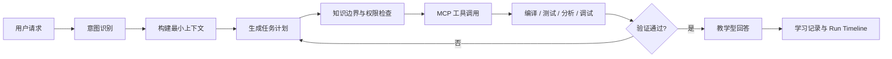
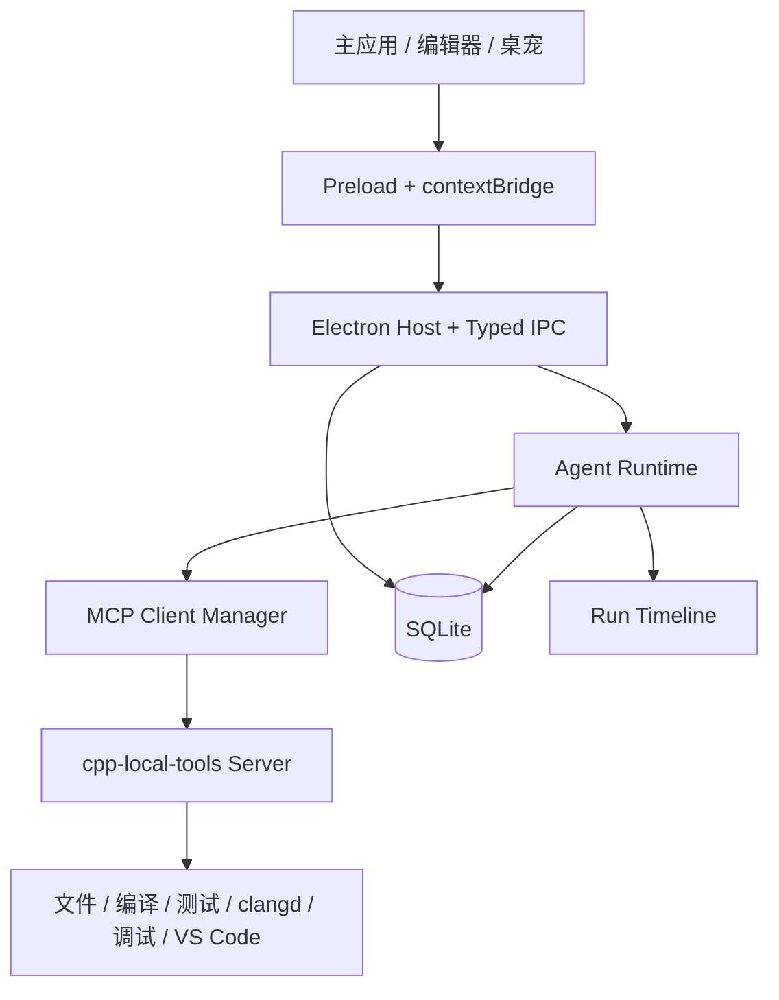

# 宠码学伴（CppPet Agent）

面向 C++ 初学者的 Windows 桌面学习 Agent。项目通过代码工作区、教学型 Agent 和桌面宠物，将环境配置、知识学习、代码编写、错误诊断、逻辑纠错与项目实践连接成一条可执行、可验证、可追踪的学习流程。

> **当前状态：开发中。** 仓库目前处于 H1 基础工程阶段。本文“规划能力”描述的是完整产品目标，不代表相关功能已经全部实现。

## 项目简介

C++ 初学者面对的困难通常不止是语法本身：编译器和 IDE 配置复杂、项目结构陌生、报错信息难以理解、逻辑错误缺少验证手段，通用 AI 还可能直接给出超出学习进度的答案。

宠码学伴希望提供一个真正参与学习过程的 Agent：它理解当前项目、代码选区、编译信息、题目要求和知识掌握状态，生成可见的任务计划，调用本地工具进行编译、运行、测试、分析和调试，再根据工具证据给出符合用户当前知识范围的讲解。

项目主要面向正在学习 C++ 的大学生，覆盖环境准备、语法入门、数据处理、解题训练、多文件项目和独立提升等阶段。

## 设计原则

- **证据优先**：能够由编译器、测试、静态分析、语言服务或调试器确认的问题，不只依赖模型推测。
- **教学优先**：默认帮助用户理解问题并继续完成任务，而不是未经解释地直接代写完整答案。
- **知识有界**：Agent 的代码、示例和术语受知识树约束，需要新知识时先解释再引导学习。
- **用户可控**：文件修改、程序执行、截图和远程数据发送均遵循明确的权限与确认规则。
- **本地优先**：代码、项目、学习进度和成就默认保存在本地，只发送完成任务所需的最小上下文。
- **过程可见**：通过 Agent Run Timeline 展示上下文、计划、工具调用、审批、结果与验证结论。

## 规划能力

| 功能域 | 完整产品目标 |
| --- | --- |
| 环境与工具链 | 自动发现并验证 VS Code、GCC、Clang、MSVC、CMake 和调试器，由用户确认后绑定工具链配置 |
| 工作区与项目 | 支持手动、题目、自然语言和导入四种建项目方式，所有文件操作限制在用户授权的工作区内 |
| C++ 编辑体验 | 提供 Monaco 编辑器、clangd/LSP 语义能力、编译运行、测试、调试、Diff、快照恢复和 VS Code 联动 |
| 教学型 Agent | 根据环境助手、概念讲解、错误诊断、解题教练、项目助手和复习教练等模式规划并执行任务 |
| 错误诊断 | 分别处理编译、链接、运行时和逻辑错误，通过最小失败用例、变量观察与回归测试形成证据链 |
| 知识与成长 | 使用带前置关系的 C++ 知识树约束讲解范围，记录学习进度、错题、复习、等级、成就和桌宠成长 |
| 桌面宠物 | 提供常驻桌面的交互入口，支持快捷询问、状态反馈、截图提问、托盘和跨应用学习场景 |
| Agent 记录 | 保存可审计的任务时间线，包括计划摘要、上下文来源、工具调用、审批、结果和验证状态 |

## Agent 工作流



Agent 不是单独的聊天框，而是由意图路由、上下文构建、规划、知识边界、权限策略、模型接入、MCP 工具、执行循环、验证、记忆和审计共同组成的任务系统。

## 系统架构



- Renderer 只负责界面和交互，不直接使用 Node.js 高权限 API。
- Preload 通过 `contextBridge` 暴露经过类型约束的最小 API。
- Electron 主进程负责窗口、文件选择、IPC 校验和桌面能力。
- Agent Runtime 负责任务规划、工具编排、验证、记忆和审计。
- 第一方 MCP Server 统一提供工作区文件、构建、测试、分析和调试能力。
- 用户 C++ 程序将在独立受限进程中运行，避免阻塞或直接影响界面进程。

## 当前进展

当前仓库正在建设 H1 基础工程，已包含以下基础能力：

- Electron、Vue 3、TypeScript 与 pnpm workspace 工程骨架。
- 基于 `contextBridge`、Zod 和共享类型的 IPC 契约。
- 工作区授权、项目创建与导入、文件树、搜索和基础文本编辑。
- 文件哈希、外部变更监听、冲突提示、修改前快照与恢复。
- SQLite WAL、Schema Migration、迁移备份和只读恢复模式。
- Vitest 契约/单元测试与 Playwright Electron E2E 测试框架。

Monaco、C++ 工具链、clangd、调试器、Agent/MCP、知识树、成长系统和桌面宠物仍属于后续阶段。

## 技术栈

| 层次 | 技术 |
| --- | --- |
| 桌面端 | Electron、electron-vite、electron-builder |
| 前端 | Vue 3、TypeScript、Vite、Pinia |
| UI | Element Plus、Lucide、Design Tokens |
| 编辑器（规划） | Monaco Editor、clangd / LSP |
| C++ 工具（规划） | GCC / Clang / MSVC、CMake、CTest、clang-tidy、GDB / LLDB、DAP |
| Agent（规划） | MCP SDK、可配置文本/多模态模型 Gateway |
| 数据 | SQLite、better-sqlite3、WAL |
| 校验 | Zod、Vitest、Playwright |

## 环境要求

- Windows 10 或 Windows 11
- Node.js 22 或更高版本
- pnpm 10.24.0（建议通过 Corepack 管理）

## 本地运行

```powershell
corepack enable
pnpm install
pnpm dev
```

首次启动开发环境时，项目会为 Electron 重建 `better-sqlite3` 等原生依赖。

## 常用命令

| 命令 | 说明 |
| --- | --- |
| `pnpm dev` | 启动 Electron 开发环境 |
| `pnpm build` | 构建全部 workspace 包和桌面应用 |
| `pnpm typecheck` | 执行 TypeScript 与 Vue 类型检查 |
| `pnpm test` | 执行单元测试和契约测试 |
| `pnpm test:e2e` | 构建应用并执行 Electron E2E 测试 |
| `pnpm verify` | 依次执行类型检查、测试、构建和 E2E 校验 |
| `pnpm package:dir` | 生成未打包的桌面应用目录 |

## 项目结构

```text
cpp-learn-agent/
|-- apps/
|   `-- desktop/          # Electron 主进程、Preload 与 Vue Renderer
|-- packages/
|   |-- contracts/        # 共享类型、Schema 与 IPC 契约
|   |-- database/         # SQLite、迁移与数据访问
|   |-- ui-kit/           # 设计变量与共享 UI 基础
|   `-- workspace-core/   # 工作区、文件、项目、搜索与快照
|-- tests/
|   `-- e2e/              # Electron Playwright 端到端测试
|-- package.json
`-- pnpm-workspace.yaml
```

## 开发路线

| 里程碑 | 阶段目标 | 主要内容 |
| --- | --- | --- |
| H1 基础交接 | 第 4 周 | 工程骨架、工作区、文件管理、数据库、快照和基础契约 |
| H2 开发能力 | 第 8 周 | 工具链绑定、Monaco、clangd、编译运行、测试、调试和 VS Code 联动 |
| H3 Agent 业务 | 第 12 周 | Agent Runtime、MCP、知识边界、学习成长与 Run Timeline |
| H4 最终交付 | 第 16 周 | 桌面宠物、完整界面、安装包、兼容性测试、文档与答辩材料 |

## 项目文档

- [应用开发策划案](./宠码学伴-C++新手学习助手应用开发策划案.md)：完整产品定义、功能规划、Agent/MCP 设计、架构、安全、分工、里程碑和验收标准。
- [成员 A 工程落地工作计划](./成员A-工程落地工作计划.md)：H1 基础工程的实现范围、接口约定和交接要求。

本项目为软件工程课程大作业，计划由 4 人在 16 周内协作完成。
