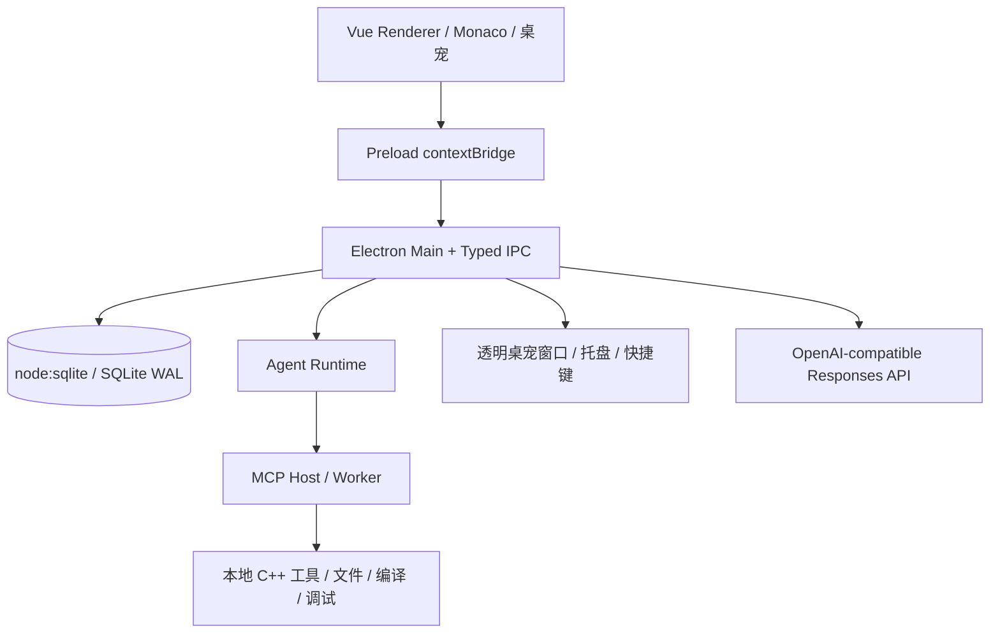

<div align="center">

# CppPilot

**带透明桌宠的 C++ 学习 Agent，把写代码、查报错、练 OJ、复习知识点和成长反馈连成一条本地闭环。**


软件工程课程大作业 · 当前版本：`0.1.0` · 最终交付口径：Windows NSIS 一键安装包

</div>

---

## 📖 项目简介

CppPilot 面向 C++ 初学者，解决的是“会打开编辑器但不知道环境、报错、练习和复习怎么连起来”的问题。应用提供本地工作区、Monaco 编辑器、C++ 编译运行/调试、教学型 Agent、知识树、OJ 练习和桌面宠物入口。

它不是单独的聊天框。Agent 会绑定当前项目、文件、选区、诊断、截图和学习进度，经过审批后调用本地工具执行编译、运行、测试、分析和调试，再把结果写回对话、错题、XP、成就和桌宠通关进度。

当前实现已经覆盖 H1-H4 主体工程：工程骨架、C++ 工具链、Agent/MCP/学习闭环、透明桌宠、多模态截图、OJ 判题、NSIS 打包配置和最终交付文档。真实 UI 截图仍需要在 Windows 桌面人工确认，README 不宣称已完成截图验收。

## 🔁 使用流程

1. 选择或导入学习工作区，信任后创建 C++ 单文件或多文件项目。
2. 在内置 Monaco 编辑器里编写代码，保存、编译、运行、测试或调试。
3. 遇到报错、选区疑问或截图题面时，从工作区 Agent、桌宠或截图预览进入助教对话。
4. Agent 根据知识边界、审批策略和工具证据给出解释、修复建议或下一步练习。
5. 通过构建、测试、复习、OJ、项目任务和成就奖励积累 XP，桌宠下方显示 4 关通关进度。

## ✨ 核心能力

### 🧑‍💻 C++ 工作区与工具链

- 支持工作区授权、项目创建/导入、文件树、搜索、多标签编辑、自动快照和冲突处理。
- 支持 GCC、Clang、MSVC、CMake、CTest、clang-tidy、clangd、GDB/MI 和 VS Code 联动；缺失工具会降级为明确提示。
- 用户代码通过受限子进程运行，带超时、取消、输出上限和 Windows 进程树回收。

### 🤖 教学型 Agent

- Agent Runtime 覆盖意图识别、最小上下文、计划、知识边界、L0-L3 审批、工具执行、验证、取消、重试和可审计 Timeline。
- OpenAI-compatible Responses API 使用 BYOK 配置；没有模型密钥时仍保留确定性离线规划器和本地工具链能力。
- 工作区右侧 Agent 与助教记录共用同一套 run/message 数据；模型审批、请求中、执行中、失败、取消、完成等状态会同步更新，不再长期卡在“正在组织回答”。

### 🐱 透明桌宠

- 透明常驻桌宠窗口基准尺寸为 `180 x 220`，支持缩放、边缘吸附、多显示器位置恢复和基于鼠标绝对屏幕坐标的稳定拖拽。
- 内置 CppPilot Logo、Salary Cat `cat.GIF`，并支持用户上传 PNG/JPG/JPEG/WEBP/GIF 自定义素材。
- 自定义素材会复制到应用 `userData/pet-assets/`，通过受控 `cpppilot-pet-asset://` 协议加载；切回 Logo 只取消当前启用状态，不删除素材库列表。
- 成长形象不再切换 4 个形态，而是在桌宠下方显示短标签赛博风通关进度条，例如 `Lv.3 · 2/4 · 60%`。

### 📸 多模态截图

- 截图预览确认后进入同一 Agent 对话链路，有项目上下文时绑定 `conversationId` 与 `assistantMessageId`。
- 截图识别只使用模型 `input_image` 输入，不做本地 OCR，也不把图片 data URL 当普通文本塞进 prompt。
- OJ 题面截图导入会要求模型返回题面、知识点、样例和 5 个可信判题用例；信息不足时拒绝添加。

### 🧪 OJ 练习场

- 内置 27 道 C++ 初学 OJ 练习和 5 个小型项目任务，按输入输出、类型、分支、循环、数组、字符串、函数、递归、结构体、排序、二分、STL 容器等知识点组织。
- 练习页提供题单、题面、样例、代码编辑、提交、判题结果、总分、5 个用例状态和失败用例输入/期望/实际输出差异。
- 用户导入的 OJ 截图必须形成完整题目和 5 个判题用例；模型无法补足可信边界用例时不会落库。

### 🧠 学习成长

- 当前知识树包含 46 个 C++ 节点，带前置关系和知识边界控制。
- SQLite 记录学习事件、错题、复习、XP、成就、练习提交和项目任务；成就 `xpReward` 首次解锁时会幂等加入总 XP。
- 桌宠进度条由真实 `LearnerSummary` 驱动，等级和 4 关成长阶段来自 XP，而不是静态展示。

## 🧠 XP 规则

| 来源 | 当前规则 |
| --- | --- |
| 环境绑定 | 工具链绑定成功记 `environment-ready`，基础 XP +10，并可解锁环境成就 |
| 编译/测试 | 编译成功 `build-succeeded` +10；样例/回归测试通过 `test-passed` +10 |
| 代码编辑 | 保存 C/C++ 文件时按有效非空白内容变化和变更行数计 `code-edited`，单次 2-12 XP；非代码文件、无变化和纯微小空白变化不计，内容指纹防重复刷经验 |
| 错误修复 | 错误被验证解决记 `error-resolved` +15，并进入成就与错题/复习链路 |
| 复习与知识 | 复习通过 `review-completed` +10；概念验证 `concept-verified` +15；OJ/项目带来的知识点通关记 `knowledge-mastered` +10/点 |
| OJ 解题 | 提交不足 100 分最多给少量过程 XP；5 个用例全过记 `practice-passed`，基础 20 XP + 难度系数 |
| 项目任务 | 完成小型项目任务记 `project-task-completed`，基础 25 XP + 难度系数，并推动相关知识点通关 |
| 成就奖励 | 首次达成成就时按定义的 `xpReward` 加到总 XP；重复事件不会重复领奖励 |

## 🧪 OJ 判题规则

- 每道 OJ 题固定 5 个判题用例，每个 20 分，总分 100。
- 用例可以包含题目样例，也可以包含隐藏边界用例；内置题全部显式配置 5 个用例。
- 提交时创建临时 C++ 源文件，复用本地工具链按 C++17 编译，再逐个运行用例并归一化输出比较。
- 编译失败直接 0 分并展示诊断；运行超时、崩溃、非零退出、输出不一致都会在对应用例上显示失败原因。
- 截图导入题必须由模型通过 `input_image` 生成或补齐 5 个可信用例；缺少题意、输入输出格式或 expected output 不可靠时拒绝添加。

## 🛠️ 技术架构



| 层次 | 技术 |
| --- | --- |
| 桌面端 | Electron、electron-vite、electron-builder、NSIS |
| 前端 | Vue 3、TypeScript、Vite、Pinia、Element Plus、Lucide |
| 编辑器 | Monaco Editor、clangd/LSP Provider、Diff 与快照恢复 |
| Agent | TypeScript Agent Runtime、MCP SDK、OpenAI-compatible Responses、确定性离线 Planner |
| C++ 执行 | GCC/Clang/MSVC、CMake/CTest、clang-tidy、GDB/MI、受限子进程 |
| 数据 | `node:sqlite`、SQLite WAL、Zod schema、迁移和只读恢复模式 |
| 验证 | Vitest、Playwright Electron、`git diff --check` |

## 🚀 本地运行与打包

环境要求：Windows 10/11、Node.js 22+、pnpm 10.24.0。

```powershell
corepack enable
pnpm install
pnpm dev
```

常用命令：

| 命令 | 说明 |
| --- | --- |
| `pnpm typecheck` | 全 workspace TypeScript/Vue 类型检查 |
| `pnpm test` | 全 workspace 单元测试和契约测试 |
| `pnpm build` | 构建所有包和桌面应用 |
| `pnpm package:nsis` | 构建 Windows NSIS 一键安装包 |
| `git diff --check` | 检查 diff 空白问题 |

NSIS 配置见 `apps/desktop/electron-builder.yml`，只生成 Windows x64 一键安装包。打包成功后安装器位于 `release/CppPilot Setup 0.1.0.exe`，当前产品名为 `CppPilot`。

## ✅ 验证状态

最终交付五项验证已在本 worktree 通过。

| 命令 | 状态 |
| --- | --- |
| `pnpm typecheck` | 通过 |
| `pnpm test` | 通过 |
| `pnpm build` | 通过 |
| `pnpm package:nsis` | 通过 |
| `git diff --check` | 通过 |

本轮还单独跑过桌宠/自定义素材、Agent 同步、OJ 导入与判题、contracts、database、agent-runtime 和 desktop typecheck 等目标验证。

## 📁 项目结构

```text
cpp-learn-agent/
|-- apps/desktop/              # Electron Main、Preload、Vue Renderer、NSIS 配置
|-- packages/contracts/        # 共享类型、Zod Schema、IPC 契约
|-- packages/agent-runtime/    # Agent 状态机、知识树、成就、练习题库
|-- packages/cpp-local-tools/  # C++ 工具链探测、编译运行、调试、进程隔离
|-- packages/database/         # SQLite 迁移、DAO、学习与练习持久化
|-- packages/workspace-core/   # 工作区、文件、项目、快照、安全路径
|-- docs/archive/              # 旧 README 和历史资料归档
|-- docs/final/                # 最终交付清单与汇报材料
|-- .codex/skills/             # 项目内可复用 README skill
|-- tests/                     # Electron E2E 与 C++ fixture
|-- package.json
`-- pnpm-workspace.yaml
```

## 📄 文档与说明

- 旧版 README 已归档到 `docs/archive/README-previous.md`。
- README 写作规范 skill 位于 `.codex/skills/cpppilot-readme-writer/`。
- 四阶段/四对话工作清单位于 `docs/final/team-work-summary.md`。
- 桌面总结材料位于 `D:\Desktop\CppPilot-项目总结材料.md`。
- 项目策划案、H1/H2/H3 历史交接文档仍保留在根目录和 `docs/handoff-*` 中。

## 📌 人工截图确认清单

以下画面需要在真实 Windows 桌面人工确认，本仓库不会把它们写成已自动截图验收：桌宠尺寸与拖拽、赛博进度条、自定义 GIF 切换、工作区 Agent 错误态、OJ 提交判题、设置页素材列表、NSIS 安装体验。

<div align="center">
  <strong>CppPilot</strong> - 让 C++ 初学从“能运行”走到“能理解、能验证、能复盘”。
</div>