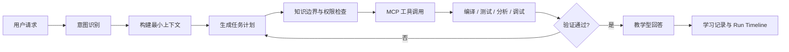
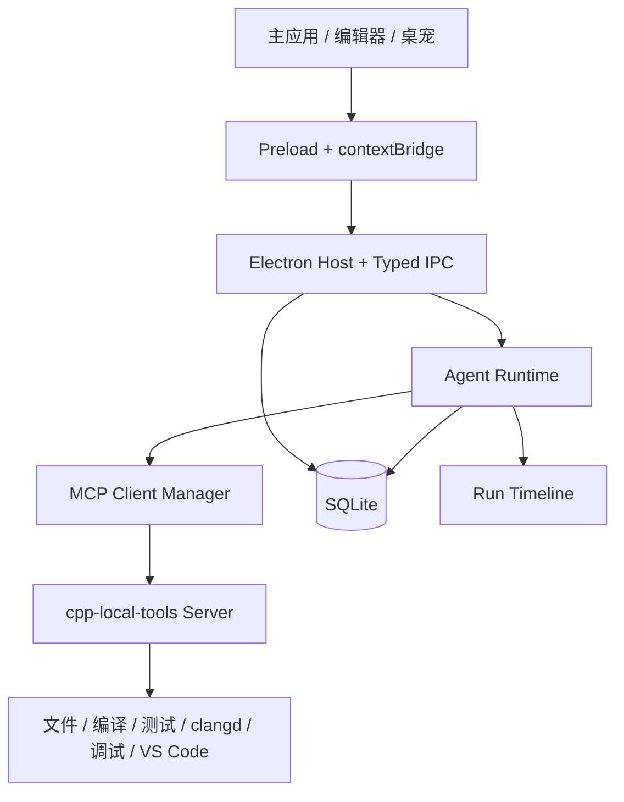

# CppPilot：带桌面宠物的 C++ 学习 Agent

面向 C++ 初学者的 Windows 桌面学习 Agent。项目通过代码工作区、教学型 Agent 和桌面宠物，将环境配置、知识学习、代码编写、错误诊断、逻辑纠错与项目实践连接成一条可执行、可验证、可追踪的学习流程。

> **当前状态：H4 工程收尾实现完成，正在执行最终验证。** H1 工程基础、H2 C++ 开发能力、H3 Agent/MCP/知识成长闭环已经完成；H4 已补齐透明桌宠拖拽边界与缩放稳定性、自定义图片/GIF 素材列表、隐藏一小时、专注模式、开机启动、选中代码问 AI、长回答/Diff/Timeline 主窗口路由、桌宠下方真实 XP 通关进度条、完整状态帧、桌宠内快速文字聊天、截图预览确认、多模态截图请求、练习题库、OJ 题面截图导入、托盘、全局快捷键和 NSIS 一键安装包配置。最终文档、答辩材料和演示脚本暂不在本轮范围内。

## 项目简介

C++ 初学者面对的困难通常不止是语法本身：编译器和 IDE 配置复杂、项目结构陌生、报错信息难以理解、逻辑错误缺少验证手段，通用 AI 还可能直接给出超出学习进度的答案。

CppPilot 希望提供一个真正参与学习过程的 Agent：它理解当前项目、代码选区、编译信息、题目要求和知识掌握状态，生成可见的任务计划，调用本地工具进行编译、运行、测试、分析和调试，再根据工具证据给出符合用户当前知识范围的讲解。

项目主要面向正在学习 C++ 的大学生，覆盖环境准备、语法入门、数据处理、解题训练、多文件项目和独立提升等阶段。

## 设计原则

- **证据优先**：能够由编译器、测试、静态分析、语言服务或调试器确认的问题，不只依赖模型推测。
- **教学优先**：默认帮助用户理解问题并继续完成任务，而不是未经解释地直接代写完整答案。
- **知识有界**：Agent 的代码、示例和术语受知识树约束，需要新知识时先解释再引导学习。
- **用户可控**：文件修改、程序执行、截图和远程数据发送均遵循明确的权限与确认规则。
- **本地优先**：代码、项目、学习进度和成就默认保存在本地，只发送完成任务所需的最小上下文。
- **过程可见**：通过 Agent Run Timeline 展示上下文、计划、工具调用、审批、结果与验证结论。

## 规划能力

| 功能域 | 完整产品目标 |
| --- | --- |
| 环境与工具链 | 自动发现并验证 VS Code、GCC、Clang、MSVC、CMake 和调试器，由用户确认后绑定工具链配置 |
| 工作区与项目 | 支持手动、题目、自然语言和导入四种建项目方式，所有文件操作限制在用户授权的工作区内 |
| C++ 编辑体验 | 提供 Monaco 编辑器、clangd/LSP 语义能力、编译运行、测试、调试、Diff、快照恢复和 VS Code 联动 |
| 教学型 Agent | 根据环境助手、概念讲解、错误诊断、解题教练、项目助手和复习教练等模式规划并执行任务 |
| 错误诊断 | 分别处理编译、链接、运行时和逻辑错误，通过最小失败用例、变量观察与回归测试形成证据链 |
| 知识与成长 | 使用带前置关系的 C++ 知识树约束讲解范围，记录学习进度、错题、复习、等级、成就和桌宠通关进度 |
| 桌面宠物 | 提供常驻桌面的交互入口，支持快捷询问、状态反馈、截图提问、托盘和跨应用学习场景 |
| Agent 记录 | 保存可审计的任务时间线，包括计划摘要、上下文来源、工具调用、审批、结果和验证状态 |

## Agent 工作流



Agent 不是单独的聊天框，而是由意图路由、上下文构建、规划、知识边界、权限策略、模型接入、MCP 工具、执行循环、验证、记忆和审计共同组成的任务系统。

## 系统架构



- Renderer 只负责界面和交互，不直接使用 Node.js 高权限 API。
- Preload 通过 `contextBridge` 暴露经过类型约束的最小 API。
- Electron 主进程负责窗口、文件选择、IPC 校验和桌面能力。
- Agent Runtime 负责任务规划、工具编排、验证、记忆和审计。
- 第一方 MCP Server 统一提供工作区文件、构建、测试、分析和调试能力。
- 用户 C++ 程序将在独立受限进程中运行，避免阻塞或直接影响界面进程。

## 当前进展

当前仓库已完成 H1、H2 和 H3 交接基线，现已包含：

- Electron、Vue 3、TypeScript 与 pnpm workspace 工程骨架。
- 基于 `contextBridge`、Zod 和共享类型的 IPC 契约。
- 工作区授权、项目创建与导入、文件树、搜索和 Monaco 多标签编辑。
- 自动保存、文件哈希、外部变更监听、Monaco Diff 冲突处理、修改前快照与恢复。
- SQLite WAL、Schema Migration、迁移备份和只读恢复模式。
- Vitest 契约/单元测试与 Playwright Electron E2E 测试框架。
- GCC、Clang、MSVC、CMake、调试器和 VS Code 的本机候选探测。
- 首次启动环境初始化向导，分步完成自动检测、工具链验证绑定、工作区授权和结果确认。
- 缺失工具提供固定官方入口；WinGet 可用时，经用户确认后可打开可见安装终端，跟踪安装结果并自动重新检测环境。应用不接受任意软件包或命令，也不会静默修改系统 PATH。
- GCC 与 MSVC Hello World 编译运行烟雾验证。
- 工具链绑定、SQLite 持久化、健康检查和设置页环境面板。
- 受限子进程的超时、取消、输出上限、标准输入和 Windows 进程树回收。
- 当前 C++ 文件的真实编译、运行和停止，支持 C++17、C++20 与 C++23 选择。
- GCC、Clang、MSVC 编译/链接诊断标准化，以及输出面板、问题面板和行内标记。
- CMake 配置与多文件构建、CTest、`compile_commands.json` 生成和中文路径兼容构建。
- clang-tidy 静态分析接口、诊断面板与缺失工具降级。
- VS Code 新窗口打开项目和当前文件行列定位。
- 标准 clangd/LSP 客户端、Monaco 补全、悬停、定义跳转、实时诊断与缺失工具降级。
- GDB/MI 单文件调试、编辑器断点、继续/单步/跳出、暂停行、局部变量、调用栈和调试输出。
- 中文项目路径的调试源码暂存与源位置回映射。
- 文件侧边栏、快照侧边栏和底部输出面板支持拖拽调整、键盘微调、双击复位与尺寸持久化。
- 成功、语法错误、链接错误、死循环、崩溃、逻辑错误和 CMake 工程固定 C++ 样例库。
- 纯 TypeScript Agent Runtime，包含意图、最小上下文、计划、知识边界、L0-L3 策略、审批、执行、验证、取消、重试、时限和可审计 Timeline。
- 真实 MCP stdio Host/Worker、24 个本地工具、7 个资源、8 个教学 Prompt，以及 Progress、Cancellation、超时和进程内降级通道。
- OpenAI-compatible BYOK 模型网关、Electron `safeStorage` 密钥隔离和无密钥可运行的确定性离线规划器。
- 环境、项目创建、选区解释、编译错误、逻辑错误、截图上下文和复习成长七条 Agent 工作流。
- 38 个有向无环 C++ 知识节点、错误本、1/3/7/14/30 天复习调度、XP、4 个成长阶段、17 枚勋章和 PetEvent；成长在桌宠下方以 4 关通关进度条展示。
- 工作区 Agent 入口、审批 Patch Diff、Agent 记录、知识树、练习题库、报告和模型设置页面；发送上下文到 OpenAI 的审批会在工作区右侧 Agent 面板和助教记录中同步可见。
- `node:sqlite` WAL 数据库、H3 v4-v7 迁移、事务回滚、运行恢复、学习事件和奖励幂等。
- H4 透明桌宠窗口，支持显示/隐藏、绝对坐标拖拽、缩放、状态气泡、鼠标穿透、边缘吸附、多显示器位置恢复和 PetEvent 状态反馈；拖拽基于起始窗口 bounds 与鼠标屏幕坐标总位移，普通移动不重算窗口宽高，重复碰边不会收缩可移动范围。
- H4 桌宠素材以列表管理，内置 CppPilot Logo 和 Salary Cat `cat.GIF`；用户每次可创建 1 个 PNG/JPG/WEBP/GIF 自定义桌宠，创建时必须命名，文件复制到应用 `userData/pet-assets/` 后本地持久化，可多次创建、启用、重命名和删除，并通过受控 `cpppilot-pet-asset://` 协议加载。
- H4 桌宠状态帧覆盖 `idle`、`listen`、`thinking`、`tool-running`、`approval`、`success`、`warning` 和 `level-up`；学习成长不再切换形象，而是在桌宠下方显示 4 关通关进度条，自定义 GIF 模式仍保留状态框、气泡和进度反馈。
- H4 桌宠右键菜单和托盘菜单已覆盖打开主窗口、快速聊天、截图提问、显示/隐藏、隐藏一小时、取消定时隐藏、专注模式、开机启动、鼠标穿透和设置入口；托盘保留退出入口。
- H4 设置页已提供桌宠素材列表、单个创建上传、命名、启用、重命名、删除、切回 Logo、隐藏一小时状态与取消、专注模式、开机启动、缩放、气泡和鼠标穿透控制。专注模式的产品语义是减少打扰：桌宠保持手动入口和托盘入口，但不主动显示气泡或打扰动画。
- H4 Monaco 选区已提供显式“问 AI”入口；打开 Agent 面板后会显示“已附带选区：文件 行 x-y”，发送时继续携带当前文件、选区内容与行列范围。
- H4 长回答、审批 Diff 和 Run Timeline 已有主窗口可见路由：长回答可定位到工作区 Agent 消息，审批 Diff 可打开工作区 Agent/Diff 视图，`/runs?runId=...&view=timeline` 会展开目标运行的处理过程。
- H4 桌宠内快速文字聊天已接入现有 Conversation/Agent 流程，创建或复用当前项目对话并绑定 `conversationId` 与 `assistantMessageId`；无项目上下文时回退到助教记录 Timeline。
- H4 截图预览确认窗口已接入 Agent 对话链路：有项目上下文时复用/新建当前对话，用户消息显示截图缩略图和问题文本，Agent Run 绑定 `conversationId` 与 `assistantMessageId`；无项目上下文时回退到助教记录。
- H4 截图识别只走多模态模型 `input_image` 输入，不做本地 OCR，也不把图片 data URL 作为普通文本发送给模型。
- H4 练习页内置 18 道按知识点分组的 C++ 练习和 5 个小型项目任务；在已配置 OpenAI-compatible Responses API 时，用户可上传 OJ 题面截图，由模型通过 `input_image` 整理题面、样例、难度和知识点分组，信息不足时拒绝添加，成功后保存为本地用户题目。
- H4 Windows 发布只配置 NSIS 一键安装包，不提供免安装目录版作为最终交付口径；打包资源包含 `tray-icon.png` 和 `app-icon.ico`，用于 Windows 托盘与窗口图标显示。

当前验证机器未安装 CMake、CTest、clangd 和 clang-tidy，因此这些工具在本机验证可恢复的缺失提示；安装对应工具后可进入现有真实执行分支。

## H4 交付口径

本轮 H4 收尾聚焦工程实现、自动化验证和 NSIS 安装包；最终答辩文档、演示脚本和人工截图验收材料不在本轮产出范围内。需要人工确认的仅是实际 Windows 桌面上的透明窗口贴边、拖拽、GIF 播放、托盘菜单、截图预览和安装器安装体验。

## 技术栈

| 层次 | 技术 |
| --- | --- |
| 桌面端 | Electron、electron-vite、electron-builder |
| 前端 | Vue 3、TypeScript、Vite、Pinia |
| UI | Element Plus、Lucide、Design Tokens |
| 编辑器 | Monaco Editor；标准 clangd / LSP 客户端与 Provider |
| C++ 工具 | GCC / Clang / MSVC 编译运行；CMake、CTest、clang-tidy、VS Code；GDB/MI 单文件调试 |
| Agent | MCP TypeScript SDK、OpenAI-compatible Gateway、确定性离线 Planner |
| 数据 | Node/Electron 内置 `node:sqlite`、SQLite WAL |
| 校验 | Zod、Vitest、Playwright |

## 环境要求

- Windows 10 或 Windows 11
- Node.js 22 或更高版本
- pnpm 10.24.0（建议通过 Corepack 管理）

## 本地运行

```powershell
corepack enable
pnpm install
pnpm dev
```

项目使用 VS Code 开发，不要求安装 Visual Studio IDE 或 Visual Studio C++ Build Tools。只有在学习者主动选择 MSVC 作为 C++ 工具链时，才需要单独安装对应的 MSVC Build Tools；应用数据库和 Electron 启动均不依赖它。

应用首次使用会自动进入环境初始化向导。选择“稍后配置”时会提示找回路径，首页也会保留可关闭的环境提醒；可在“设置 → C++ 工具链 → 环境向导”再次打开。已经使用过旧版本的本地数据不会被强制重新引导。

## 常用命令

| 命令 | 说明 |
| --- | --- |
| `pnpm dev` | 启动 Electron 开发环境 |
| `pnpm build` | 构建全部 workspace 包和桌面应用 |
| `pnpm typecheck` | 执行 TypeScript 与 Vue 类型检查 |
| `pnpm test` | 执行单元测试和契约测试 |
| `pnpm test:e2e` | 构建应用并执行 Electron E2E 测试 |
| `pnpm verify` | 依次执行类型检查、测试、构建和 E2E 校验 |
| `pnpm package:nsis` | 构建 Windows NSIS 一键安装包，产物位于 `release/` |

## 项目结构

```text
cpp-learn-agent/
|-- apps/
|   `-- desktop/          # Electron 主进程、Preload 与 Vue Renderer
|-- packages/
|   |-- contracts/        # 共享类型、Schema 与 IPC 契约
|   |-- agent-runtime/    # Agent 状态机、策略、模型、知识与工作流
|   |-- cpp-local-tools/  # 工具链探测、受限进程与烟雾验证
|   |-- database/         # SQLite、迁移与数据访问
|   |-- ui-kit/           # 设计变量与共享 UI 基础
|   `-- workspace-core/   # 工作区、文件、项目、搜索与快照
|-- docs/
|   |-- handoff-a/        # H1 历史交接
|   |-- handoff-b/        # H2 历史交接
|   `-- handoff-c/        # H3 当前交接基线
|-- tests/
|   `-- e2e/              # Electron Playwright 端到端测试
|-- package.json
`-- pnpm-workspace.yaml
```

## 开发路线

| 里程碑 | 阶段目标 | 主要内容 |
| --- | --- | --- |
| H1 基础交接 | 第 4 周 | 工程骨架、工作区、文件管理、数据库、快照和基础契约 |
| H2 开发能力 | 第 8 周 | 工具链绑定、Monaco、clangd、编译运行、测试、调试和 VS Code 联动 |
| H3 Agent 业务 | 第 12 周 | Agent Runtime、MCP、知识边界、学习成长与 Run Timeline |
| H4 最终交付 | 第 16 周 | 桌面宠物、截图多模态、托盘快捷键、NSIS 安装包和兼容性测试；最终文档与答辩材料暂缓 |

## 项目文档

- [应用开发策划案](./CppPilot：带桌面宠物的%20C++%20学习%20Agent%20应用开发策划案.md)：完整产品定义、功能规划、Agent/MCP 设计、架构、安全、分工、里程碑与验收标准。
- [成员 A 工程落地工作计划](./成员A-工程落地工作计划.md)：H1 基础工程的实现范围、接口约定和交接要求。
- [H1 架构说明](./docs/handoff-a/architecture.md)：进程边界、包依赖和成员 B 接入点。
- [H1 运行手册](./docs/handoff-a/runbook.md)：原生 SQLite ABI、开发、测试、打包和故障排查。
- [H1 接收清单](./docs/handoff-a/h1-acceptance.md)：成员 B 在独立环境执行的验收步骤。
- [成员 B 工作计划](./docs/handoff-b/work-plan.md)：H2 分批实现范围与当前进度。
- [成员 B H2 交接说明](./docs/handoff-b/handoff.md)：交接基线、阅读顺序、已交付能力和成员 C 接入点。
- [成员 B 第 2 批测试报告](./docs/handoff-b/batch-2-test-report.md)：Monaco、编译运行、诊断和 Electron E2E 验证结果。
- [成员 B 第 3 批工程工具测试报告](./docs/handoff-b/batch-3-engineering-test-report.md)：CMake、CTest、clang-tidy、VS Code 与中文路径构建验证结果。
- [H2 接收清单](./docs/handoff-b/h2-acceptance.md)：成员 C 独立验收 H2 开发能力的步骤。
- [H2 运行手册](./docs/handoff-b/runbook.md)：工具链、clangd、断点调试和原生 ABI 操作。
- [H2 契约说明](./docs/handoff-b/contracts.md)：编译、语言服务、调试与外部编辑器 IPC。
- [H2 已知问题](./docs/handoff-b/known-issues.md)：本机工具缺失和当前后端范围。
- [H3 架构说明](./docs/handoff-c/architecture.md)：Agent Runtime、MCP、数据库、进程边界和 H4 接入点。
- [H3 契约说明](./docs/handoff-c/contracts.md)：Run、审批、学习、IPC 和 PetEvent 稳定接口。
- [H3 MCP 能力目录](./docs/handoff-c/mcp-catalog.md)：Tools、Resources、Prompts、风险和超时。
- [H3 运行手册](./docs/handoff-c/runbook.md)：VS Code 开发、启动、验证、演示和故障排查。
- [H3 测试报告](./docs/handoff-c/test-report.md)：单元、集成、Electron E2E、构建环境和限制。
- [H3 接收清单](./docs/handoff-c/h3-acceptance.md)：规格逐项证据和成员 D/H4 接入检查。
- [H3 已知问题](./docs/handoff-c/known-issues.md)：当前工具环境、bundle 体积和 H4 范围。

本项目为软件工程课程大作业，计划由 4 人在 16 周内协作完成。
