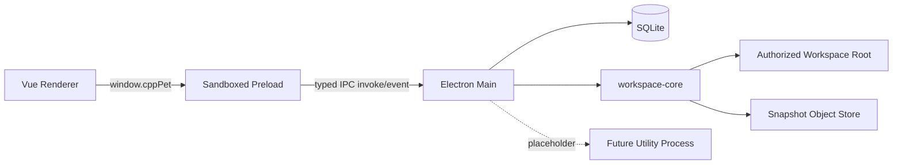

# 宠码学伴：成员 A 工程落地工作计划

> 文档性质：H1 工程落地与开发设计规格  
> 适用范围：成员 A 负责的基础工程、工作区、数据与首批高保真界面  
> 首要平台：Windows 10 / Windows 11  
> 上游依据：《宠码学伴-C++新手学习助手应用开发策划案》  
> 排期方式：不绑定日期，按依赖关系和验收门组织实施

## 1. 文档定位

### 1.1 目标

成员 A 需要交付一个可以被成员 B 直接接续开发的 H1 基础版本。该版本不是静态原型，而是具备真实数据、真实文件操作、真实持久化和可验证安全边界的桌面应用底座。

H1 完成后，应用至少应当做到：

1. 在干净 Windows 环境中安装依赖、启动 Electron 应用并运行测试。
2. 创建、导入、打开、移除项目，管理授权工作区。
3. 浏览、读取、创建、编辑、复制、移动、重命名、删除和搜索文件。
4. 对文件变更建立快照，预览恢复影响并完成恢复。
5. 重启应用后保留工作区、项目、设置、快照和最近使用状态。
6. Renderer 无法直接访问 Node、SQLite、文件系统或任意 IPC 通道。
7. 首页和工作区具备接近最终产品的 Codex 式桌面工具界面。
8. 为工具链、Monaco、Agent、学习系统和桌宠提供稳定插槽、契约与确定性 Mock。

### 1.2 成员 A 的范围

| 范围 | 本阶段要求 |
|---|---|
| 工程 | 建立 pnpm Monorepo、统一脚本、TypeScript、构建、测试、日志和打包基础 |
| Electron | Main、Preload、Renderer、窗口生命周期、安全策略和原生对话框 |
| 契约 | 第一版共享类型、Zod Schema、类型化 IPC、错误对象和领域事件 |
| 数据 | SQLite 初始化、迁移、Repository、备份、恢复和只读恢复模式 |
| 工作区 | Root 选择、授权、信任状态、最近使用和移除登记 |
| 项目 | 手动、题目、描述、导入四种入口及项目模板 |
| 文件 | 文件树、读写、搜索、复制、移动、重命名、删除、监听和冲突检测 |
| 快照 | 内容去重、清单、自动/手动快照、差异预览和恢复 |
| UI | 高保真首页、工作区、项目创建流程、应用外壳和主题系统 |
| Mock | 环境状态、Agent、学习进度、未来页面数据和交互状态 |
| 交接 | H1 文档、测试证据、示例数据、已知问题和成员 B 接收清单 |

### 1.3 明确不做

以下能力仅定义接口或 Mock，不在 H1 实现真实业务：

- GCC、Clang、MSVC、CMake、clangd、clang-tidy、DAP 和 VS Code CLI。
- Monaco Editor、语义补全、诊断标记、调试控制台和编译运行。
- 模型调用、Agent Runtime、MCP Host/Server、Knowledge Gate 和审批工作流。
- 知识树、练习记录、错误本、成就、等级和长期学习画像。
- 桌宠窗口、截图问答、托盘、全局快捷键和成长动画。
- Windows 安装包的最终签名、全产品视觉统稿和答辩材料。

## 2. H1 交付口径

### 2.1 H1 必须交付

- 可启动的 Electron + Vue 桌面应用。
- 可复用的 Codex 式应用外壳和 Design Tokens。
- 可运行的 SQLite 数据库与迁移。
- 可授权的工作区和完整项目/文件/快照主流程。
- 类型化 Preload API、共享契约和契约测试。
- 首页与工作区的浅色、深色高保真实现。
- 确定性 Mock 数据和后续模块插槽。
- 单元、集成、E2E 和安全测试。
- H1 架构、数据库、接口、运行、测试和交接文档。

### 2.2 H1 Definition of Done

每项功能同时满足以下条件才算完成：

1. 正常、空、加载、失败、取消和权限拒绝状态均有处理。
2. 所有公开输入都有运行时 Schema 校验。
3. 所有高权限操作只在 Main 或受控 Node 包中执行。
4. 关键变更产生领域事件并写入本地事件记录。
5. 数据、文件和界面状态在重启后符合预期。
6. 单元或契约测试覆盖核心规则，主流程有 E2E 覆盖。
7. 用户可见术语与策划案保持一致。
8. 成员 B 能在未使用 A 本机环境状态的情况下完成 H1 接收。

## 3. 技术基线

### 3.1 固定技术方案

| 领域 | 选择 | 使用原则 |
|---|---|---|
| 包管理 | pnpm workspace | 根目录统一锁文件和脚本，不引入额外任务编排框架 |
| 桌面框架 | Electron | 主窗口、原生文件对话框、窗口主题和后续桌宠入口 |
| 构建 | electron-vite + Vite | 分别构建 Main、Preload 和 Renderer |
| 前端 | Vue 3 + TypeScript | 使用 Composition API 和 `<script setup>` |
| 路由 | Vue Router | 页面壳和未来模块路由预留 |
| 状态 | Pinia | 按应用、工作区、项目、文件、快照和 UI 分域 |
| 基础控件 | Element Plus | 仅使用表单、弹窗、菜单、提示等基础能力 |
| 图标 | lucide-vue-next | 不手绘通用工具图标 |
| Schema | Zod | 共享类型、IPC 参数和持久化 JSON 校验 |
| 数据库 | better-sqlite3 | 仅 Main 访问，使用 WAL 和显式迁移 |
| 文件监听 | chokidar | 统一 Windows 文件变化、去抖和忽略规则 |
| 单元测试 | Vitest | 契约、核心服务和 Repository |
| E2E | Playwright | Renderer 流程、主题和截图回归 |
| 打包基础 | electron-builder | A 只建立配置和开发包验证，最终发布由 D 完成 |

### 3.2 根命令

根目录至少提供以下稳定命令：

```json
{
  "scripts": {
    "dev": "pnpm --filter @cpp-pet/desktop dev",
    "build": "pnpm -r build",
    "typecheck": "pnpm -r typecheck",
    "lint": "pnpm -r lint",
    "test": "pnpm -r test",
    "test:contracts": "pnpm --filter @cpp-pet/contracts test",
    "test:integration": "vitest run -c tests/integration/vitest.config.ts",
    "test:e2e": "playwright test",
    "verify": "pnpm lint && pnpm typecheck && pnpm test && pnpm test:e2e",
    "package:dir": "pnpm --filter @cpp-pet/desktop package:dir"
  }
}
```

要求：

- `pnpm dev` 启动桌面应用及热更新。
- `pnpm build` 生成 Main、Preload、Renderer 和共享包产物。
- `pnpm verify` 是 H1 交接前的统一质量门。
- CI 与本地使用同一组命令，不维护另一套隐式流程。

### 3.3 编码约定

- TypeScript 开启 `strict`、`noUncheckedIndexedAccess` 和 `exactOptionalPropertyTypes`。
- 包内只从公开 `index.ts` 导出跨包 API，禁止引用其他包内部路径。
- 文件、数据库和 IPC 服务返回结构化结果，不通过字符串判断错误。
- UI 文本集中管理；H1 可只提供简体中文，但结构必须允许后续国际化。
- 路径字段在契约层区分绝对路径、项目相对路径和资源 URI，不混用普通字符串语义。
- 时间统一存储为 ISO 8601 UTC 字符串，显示时转换为本地时区。
- ID 使用 UUID，内容对象使用 SHA-256。

## 4. Monorepo 项目结构

### 4.1 目录树

```text
cpp-learn-agent/
├─ apps/
│  └─ desktop/
│     ├─ electron.vite.config.ts
│     ├─ electron-builder.yml
│     ├─ package.json
│     └─ src/
│        ├─ main/
│        │  ├─ index.ts
│        │  ├─ bootstrap/
│        │  │  ├─ bootstrap-app.ts
│        │  │  └─ bootstrap-result.ts
│        │  ├─ windows/
│        │  │  ├─ create-main-window.ts
│        │  │  └─ window-state.ts
│        │  ├─ ipc/
│        │  │  ├─ register-ipc.ts
│        │  │  ├─ sender-guard.ts
│        │  │  └─ handlers/
│        │  ├─ dialogs/
│        │  │  ├─ select-directory.ts
│        │  │  └─ confirm-destructive-action.ts
│        │  ├─ services/
│        │  │  ├─ app-services.ts
│        │  │  └─ domain-event-service.ts
│        │  ├─ security/
│        │  │  ├─ content-security-policy.ts
│        │  │  └─ navigation-policy.ts
│        │  └─ utility/
│        │     └─ agent-runtime-placeholder.ts
│        ├─ preload/
│        │  ├─ index.ts
│        │  └─ expose-cpp-pet-api.ts
│        └─ renderer/
│           ├─ index.html
│           └─ src/
│              ├─ main.ts
│              ├─ App.vue
│              ├─ router/
│              ├─ stores/
│              ├─ services/
│              ├─ components/
│              │  ├─ shell/
│              │  ├─ workspace/
│              │  ├─ project/
│              │  ├─ snapshots/
│              │  └─ feedback/
│              ├─ views/
│              │  ├─ HomeView.vue
│              │  ├─ WorkspaceView.vue
│              │  ├─ KnowledgeMockView.vue
│              │  ├─ PracticeMockView.vue
│              │  ├─ ReportsMockView.vue
│              │  ├─ RunsMockView.vue
│              │  └─ SettingsView.vue
│              ├─ editor/
│              │  ├─ editor-host.ts
│              │  └─ BasicTextEditor.vue
│              ├─ mocks/
│              └─ styles/
├─ packages/
│  ├─ contracts/
│  │  └─ src/
│  │     ├─ app/
│  │     ├─ errors/
│  │     ├─ events/
│  │     ├─ workspace/
│  │     ├─ project/
│  │     ├─ files/
│  │     ├─ snapshots/
│  │     ├─ mocks/
│  │     └─ index.ts
│  ├─ database/
│  │  └─ src/
│  │     ├─ client/
│  │     ├─ migrations/
│  │     ├─ repositories/
│  │     ├─ backup/
│  │     └─ index.ts
│  ├─ workspace-core/
│  │  └─ src/
│  │     ├─ roots/
│  │     ├─ projects/
│  │     ├─ files/
│  │     ├─ search/
│  │     ├─ watcher/
│  │     ├─ snapshots/
│  │     └─ index.ts
│  └─ ui-kit/
│     └─ src/
│        ├─ tokens/
│        ├─ components/
│        ├─ icons/
│        ├─ themes/
│        └─ index.ts
├─ resources/
│  ├─ courses/
│  ├─ exercises/
│  └─ pet/
├─ tests/
│  ├─ contracts/
│  ├─ integration/
│  ├─ e2e/
│  └─ fixtures/
│     ├─ workspaces/
│     └─ snapshots/
├─ docs/
│  └─ handoff-a/
│     ├─ architecture.md
│     ├─ contracts.md
│     ├─ database.md
│     ├─ runbook.md
│     ├─ test-report.md
│     ├─ known-issues.md
│     └─ h1-acceptance.md
├─ package.json
├─ pnpm-workspace.yaml
├─ tsconfig.base.json
├─ eslint.config.js
├─ prettier.config.mjs
├─ playwright.config.ts
└─ README.md
```

### 4.2 包职责和依赖方向

依赖方向固定为：

```text
contracts  <- database
contracts  <- workspace-core <- desktop/main
contracts  <- ui-kit         <- desktop/renderer
contracts  <- desktop/preload
```

规则：

- `contracts` 不依赖 Electron、Vue、数据库或 Node 文件系统。
- `database` 不依赖 Renderer，仅接受领域类型和数据库路径。
- `workspace-core` 不依赖 Electron UI；原生对话框由 Main 提供选择结果。
- Renderer 不直接依赖 `database`、`workspace-core` 或 Node 内置模块。
- `ui-kit` 可以依赖 Vue 和 Element Plus，但不能包含工作区业务。
- A 建立 `ui-kit` v0 的 Tokens、应用外壳和通用交互；D 在 H3 后取得最终视觉维护权。

## 5. 运行时架构

### 5.1 进程关系



### 5.2 Renderer

Renderer 只负责：

- 页面、组件、键盘交互和可访问性。
- Pinia 状态和路由。
- 调用 `window.cppPet`。
- 展示结构化错误、加载、空状态和领域事件结果。
- 管理尚未保存的编辑缓冲区，但不能直接触碰磁盘。

Renderer 中必须满足：

- `window.require`、`process` 和 Node 文件系统不可用。
- 不使用 `v-html` 渲染外部或 Mock 文本。
- 不将绝对路径拼接后传给 Main 执行操作。
- 不保存数据库连接、Root 权限或原生文件句柄。

### 5.3 Preload

Preload 只完成：

1. 使用 `contextBridge` 暴露固定命名空间。
2. 对调用参数执行客户端侧 Zod 校验。
3. 将调用映射到固定 IPC 通道。
4. 将 Main 返回值再次校验后交给 Renderer。
5. 对事件订阅返回显式取消函数。

禁止暴露：

- `ipcRenderer.send`、`invoke(channel, payload)` 等通用方法。
- Electron、Node、Shell、数据库或文件系统对象。
- 允许 Renderer 自定义通道名称的任何入口。

### 5.4 Main

Main 负责：

- 创建、恢复和关闭窗口。
- 建立数据库、迁移和恢复模式。
- 实例化 Repository、ProjectService、FileService 和 SnapshotService。
- 注册类型化 IPC，并校验发送者、参数、权限和当前项目。
- 调用 Windows 原生目录选择和破坏性操作确认框。
- 统一记录日志、领域事件和用户可恢复错误。
- 阻止非预期导航、新窗口和外部资源加载。

### 5.5 启动流程

启动顺序固定为：

1. Electron `ready`。
2. 确定 `userData`、数据库、日志、备份和快照目录。
3. 创建所需目录并检查可写性。
4. 打开 SQLite，执行完整性检查和待执行迁移。
5. 迁移失败时恢复备份并进入只读恢复模式。
6. 构造 Repository 和领域服务。
7. 注册 IPC。
8. 创建主窗口。
9. Renderer 调用 `app.getBootstrap()` 获取主题、恢复状态、最近工作区和 Mock 摘要。
10. 恢复上次窗口尺寸、位置和最后打开项目；无有效记录时进入首页空状态。

### 5.6 BrowserWindow 安全基线

```ts
{
  minWidth: 1024,
  minHeight: 720,
  width: 1440,
  height: 900,
  show: false,
  autoHideMenuBar: true,
  titleBarStyle: 'hidden',
  titleBarOverlay: true,
  webPreferences: {
    preload,
    contextIsolation: true,
    nodeIntegration: false,
    sandbox: true,
    webSecurity: true
  }
}
```

附加规则：

- 窗口在 `ready-to-show` 后显示，避免白屏闪烁。
- `setWindowOpenHandler` 默认拒绝新窗口。
- `will-navigate` 只允许应用自身入口。
- 生产 CSP 至少限制为 `default-src 'self'`，禁止对象、框架和任意远程脚本。
- 开发环境只为 Vite HMR 放开必要的本机连接，不把开发策略带入生产包。
- 外部链接必须由白名单判断后通过系统浏览器打开。

## 6. 共享契约与 IPC

### 6.1 通用返回与错误

```ts
export type ApiResult<T> =
  | { ok: true; data: T }
  | { ok: false; error: AppError }

export interface AppError {
  code: ErrorCode
  message: string
  retryable: boolean
  userAction: string
  details?: Record<string, unknown>
  traceId?: string
}

export interface DomainEvent<T = unknown> {
  eventId: string
  type: string
  version: 1
  occurredAt: string
  actor: 'user' | 'system' | 'agent' | 'tool'
  projectId?: string
  payload: T
}
```

错误代码按领域分组：

| 前缀 | 用途 | 示例 |
|---|---|---|
| `APP_` | 启动和窗口 | `APP_RECOVERY_MODE` |
| `DATA_` | 数据库和迁移 | `DATA_MIGRATION_FAILED` |
| `WS_` | 工作区和路径 | `WS_PATH_OUTSIDE_ROOT` |
| `PROJECT_` | 项目生命周期 | `PROJECT_NAME_CONFLICT` |
| `FILE_` | 文件读写和冲突 | `FILE_REVISION_CONFLICT` |
| `SNAPSHOT_` | 快照和恢复 | `SNAPSHOT_BLOB_MISSING` |
| `IPC_` | 通道、Schema 和发送者 | `IPC_SENDER_REJECTED` |
| `POLICY_` | 信任和权限 | `POLICY_WORKSPACE_READ_ONLY` |

详细堆栈只进入本地日志，Renderer 只得到友好信息、可重试标记和下一步操作。

### 6.2 核心类型

```ts
export type TrustState = 'inspection' | 'trusted' | 'revoked'
export type ProjectCreationMode = 'manual' | 'problem' | 'description' | 'import'
export type ProjectType = 'single-file' | 'multi-file' | 'cmake'

export interface Workspace {
  id: string
  name: string
  rootPath: string
  trustState: TrustState
  createdAt: string
  lastOpenedAt: string
  readOnlyReason?: string
}

export interface Project {
  id: string
  workspaceId: string
  name: string
  type: ProjectType
  creationMode: ProjectCreationMode
  relativeRoot: string
  problemId?: string
  createdAt: string
  updatedAt: string
  lastOpenedAt: string
}

export interface ProjectDraft {
  draftId: string
  mode: ProjectCreationMode
  workspaceId?: string
  name: string
  type: ProjectType
  relativeRoot: string
  proposedFiles: Array<{
    relativePath: string
    content: string
  }>
  problem?: {
    statement: string
    constraints: string[]
    samples: Array<{ input: string; output: string }>
  }
  sourceDirectory?: string
  warnings: string[]
}

export interface FileTreeNode {
  name: string
  relativePath: string
  kind: 'file' | 'directory'
  editable: boolean
  size?: number
  modifiedAt?: string
  children?: FileTreeNode[]
}

export interface FileDocument {
  projectId: string
  relativePath: string
  content: string
  contentHash: string
  modifiedAt: string
  encoding: 'utf8' | 'utf8-bom'
  eol: 'lf' | 'crlf'
  readOnly: boolean
}

export interface FileRevision {
  projectId: string
  relativePath: string
  content: string
  expectedHash: string
  createSnapshot: boolean
}

export interface SnapshotManifest {
  id: string
  projectId: string
  label: string
  reason: 'manual' | 'before-write' | 'before-delete' | 'before-restore'
  scope: 'project' | 'files'
  entries: Array<{
    relativePath: string
    contentHash: string
    size: number
  }>
  createdAt: string
}

export interface WorkspaceChangedEvent {
  workspaceId: string
  projectId?: string
  kind: 'created' | 'changed' | 'deleted' | 'renamed' | 'trust-changed'
  relativePath?: string
  previousRelativePath?: string
  contentHash?: string
  occurredAt: string
}
```

所有类型都配套 Zod Schema，并通过 `z.infer` 或类型一致性测试保证静态类型与运行时 Schema 不分叉。

### 6.3 Renderer 公共 API

```ts
export interface CppPetApi {
  app: {
    getBootstrap(): Promise<ApiResult<AppBootstrap>>
    getVersion(): Promise<ApiResult<string>>
  }
  settings: {
    get(): Promise<ApiResult<AppSettings>>
    update(input: UpdateSettingsInput): Promise<ApiResult<AppSettings>>
  }
  workspace: {
    selectRoot(): Promise<ApiResult<Workspace | null>>
    list(): Promise<ApiResult<Workspace[]>>
    setTrust(input: { workspaceId: string; trusted: boolean }): Promise<ApiResult<Workspace>>
    open(input: { workspaceId: string }): Promise<ApiResult<Workspace>>
    remove(input: { workspaceId: string }): Promise<ApiResult<void>>
    onChanged(listener: (event: WorkspaceChangedEvent) => void): () => void
  }
  project: {
    preview(input: ProjectDraftInput): Promise<ApiResult<ProjectDraft>>
    create(input: { draftId: string }): Promise<ApiResult<Project>>
    previewImport(): Promise<ApiResult<ProjectDraft | null>>
    import(input: { draftId: string }): Promise<ApiResult<Project>>
    list(input: { workspaceId?: string }): Promise<ApiResult<Project[]>>
    open(input: { projectId: string }): Promise<ApiResult<Project>>
    remove(input: { projectId: string; deleteFiles: boolean }): Promise<ApiResult<void>>
  }
  files: {
    listTree(input: { projectId: string }): Promise<ApiResult<FileTreeNode[]>>
    read(input: { projectId: string; relativePath: string }): Promise<ApiResult<FileDocument>>
    write(input: FileRevision): Promise<ApiResult<FileDocument>>
    create(input: CreateEntryInput): Promise<ApiResult<FileTreeNode>>
    copy(input: CopyEntryInput): Promise<ApiResult<void>>
    move(input: MoveEntryInput): Promise<ApiResult<void>>
    rename(input: RenameEntryInput): Promise<ApiResult<void>>
    remove(input: RemoveEntryInput): Promise<ApiResult<void>>
    search(input: SearchFilesInput): Promise<ApiResult<SearchResult[]>>
  }
  snapshots: {
    create(input: CreateSnapshotInput): Promise<ApiResult<SnapshotManifest>>
    list(input: { projectId: string }): Promise<ApiResult<SnapshotManifest[]>>
    previewRestore(input: RestoreSnapshotInput): Promise<ApiResult<RestorePreview>>
    restore(input: RestoreSnapshotInput): Promise<ApiResult<void>>
    remove(input: { snapshotId: string }): Promise<ApiResult<void>>
  }
  mocks: {
    getDashboard(): Promise<ApiResult<MockDashboard>>
    getFutureModuleState(): Promise<ApiResult<FutureModuleMockState>>
  }
}
```

### 6.4 IPC 通道

所有请求使用 `ipcMain.handle / ipcRenderer.invoke`；只有工作区变化等流式通知使用事件通道。

| 通道 | 方向 | 说明 |
|---|---|---|
| `app:get-bootstrap` | Renderer → Main | 启动状态和最近数据 |
| `app:get-version` | Renderer → Main | 应用版本 |
| `settings:get` | Renderer → Main | 获取设置 |
| `settings:update` | Renderer → Main | 更新主题和基础设置 |
| `workspace:select-root` | Renderer → Main | 原生目录选择并登记工作区 |
| `workspace:list` | Renderer → Main | 列出工作区 |
| `workspace:set-trust` | Renderer → Main | 更新信任状态 |
| `workspace:open` | Renderer → Main | 打开已登记工作区 |
| `workspace:remove` | Renderer → Main | 只移除应用登记 |
| `workspace:changed` | Main → Renderer | 文件或信任状态变化 |
| `project:preview` | Renderer → Main | 生成项目草稿和文件树 |
| `project:create` | Renderer → Main | 确认草稿并创建 |
| `project:preview-import` | Renderer → Main | 选择目录并生成导入预览 |
| `project:import` | Renderer → Main | 确认导入 |
| `project:list` | Renderer → Main | 列出项目 |
| `project:open` | Renderer → Main | 打开项目 |
| `project:remove` | Renderer → Main | 解除登记或确认后删除文件 |
| `files:list-tree` | Renderer → Main | 获取文件树 |
| `files:read` | Renderer → Main | 读取文本文件 |
| `files:write` | Renderer → Main | 带版本哈希写入 |
| `files:create/copy/move/rename/remove` | Renderer → Main | 文件管理 |
| `files:search` | Renderer → Main | 受限搜索 |
| `snapshots:create/list/preview-restore/restore/remove` | Renderer → Main | 快照生命周期 |
| `mocks:get-dashboard` | Renderer → Main | 首页 Mock |
| `mocks:get-future-module-state` | Renderer → Main | 后续模块 Mock |

### 6.5 IPC 防护

每次 IPC 调用按以下顺序处理：

1. 确认发送者是主窗口当前 `webContents`。
2. 使用对应 Zod Schema 解析参数。
3. 根据 `workspaceId/projectId` 查询真实授权 Root。
4. 检查工作区信任状态和操作风险。
5. 调用领域服务。
6. 将未知异常转换为 `AppError`。
7. 使用响应 Schema 校验返回值。
8. 对关键操作记录领域事件。

## 7. 数据库设计

### 7.1 存储位置

```text
<Electron userData>/
├─ data/
│  └─ cpp-pet.sqlite
├─ backups/
│  └─ pre-migration-<timestamp>.sqlite
├─ snapshots/
│  ├─ manifests/
│  └─ blobs/
└─ logs/
```

项目源文件始终保存在用户选择的工作区，数据库不保存项目文件的当前完整副本。快照内容保存在应用控制的对象存储中，数据库保存清单和索引。

### 7.2 SQLite 设置

数据库打开后执行：

```sql
PRAGMA foreign_keys = ON;
PRAGMA journal_mode = WAL;
PRAGMA synchronous = NORMAL;
PRAGMA busy_timeout = 5000;
```

关闭应用前尝试执行 WAL checkpoint，但不能因 checkpoint 失败阻断正常退出。

### 7.3 H1 表结构

| 表 | 关键字段 | 说明 |
|---|---|---|
| `schema_migrations` | `version`、`name`、`checksum`、`applied_at` | 迁移版本和篡改检测 |
| `users` | `id`、`nickname`、`created_at`、`updated_at` | 单机本地用户档案 |
| `settings` | `scope`、`owner_id`、`key`、`value_json` | 应用、工作区和项目设置 |
| `workspaces` | `id`、`root_path`、`normalized_root`、`trust_state`、`last_opened_at` | 授权 Root 和信任状态 |
| `projects` | `id`、`workspace_id`、`name`、`type`、`creation_mode`、`relative_root` | 项目元数据 |
| `problems` | `id`、`statement`、`constraints_json`、`samples_json` | 题目创建模式的数据 |
| `file_snapshots` | `id`、`project_id`、`reason`、`scope`、`manifest_path`、`created_at` | 快照头信息 |
| `snapshot_entries` | `snapshot_id`、`relative_path`、`content_hash`、`blob_hash`、`size` | 快照文件清单 |
| `domain_events` | `event_id`、`type`、`occurred_at`、`actor`、`project_id`、`payload_json` | H1 领域事件记录 |

约束：

- `workspaces.normalized_root` 唯一，Windows 比较时使用规范化大小写和分隔符。
- `projects` 对未移除记录保证 `workspace_id + relative_root` 唯一。
- JSON 字段在写入前用 Zod 验证，读取失败转换为 `DATA_RECORD_INVALID`。
- 删除工作区或项目默认使用软删除/解除登记，不级联删除用户磁盘文件。
- 删除快照时，仅在没有其他快照引用的情况下清理 Blob。

### 7.4 Repository 边界

至少实现：

- `SettingsRepository`
- `WorkspaceRepository`
- `ProjectRepository`
- `ProblemRepository`
- `SnapshotRepository`
- `DomainEventRepository`

Repository 只处理持久化，不包含目录选择、路径权限或 UI 逻辑。领域服务负责事务边界和跨 Repository 操作。

### 7.5 迁移、备份和恢复

迁移流程：

1. 读取 `schema_migrations` 并校验已应用迁移的 checksum。
2. 若存在待迁移版本，先 checkpoint WAL。
3. 使用 SQLite backup API 生成带时间戳的预迁移备份。
4. 在事务中应用待执行 SQL 并记录版本。
5. 执行 `quick_check`。
6. 成功后正常启动。
7. 失败时保留失败数据库副本，恢复备份并以只读模式启动。
8. 首页显示数据恢复状态和备份位置，不自动覆盖更多文件。

恢复模式下允许浏览已有工作区和项目元数据，但禁止设置、文件和快照写操作。

## 8. 工作区、项目与文件设计

### 8.1 工作区授权

- 用户只能通过 Electron 原生目录选择器登记 Root。
- 新导入 Root 默认处于 `inspection`，允许读取、建立索引和显示文件树。
- 用户明确点击信任后转为 `trusted`，才允许创建、修改、移动、删除和恢复文件。
- 取消信任后转为 `revoked`，保留登记和历史，但所有写操作失败。
- 工作区移除只删除应用登记、监听和最近使用状态，不删除磁盘内容。

### 8.2 路径安全算法

每个文件操作必须执行：

1. 拒绝空路径、NUL 字符和绝对路径。
2. 使用当前平台规则规范化分隔符。
3. 拒绝任何 `..` 段和 Windows 设备名，如 `CON`、`PRN`、`AUX`、`NUL`、`COM1`。
4. 由数据库中的工作区 Root 和项目 `relativeRoot` 计算候选路径。
5. 使用 `path.relative` 做词法包含检查。
6. 对已存在目标执行 `realpath`，再次验证实际路径位于真实 Root 内。
7. 对待创建目标向上寻找最近的已存在父目录，对父目录执行 `realpath`。
8. 若任一父级是指向 Root 外的符号链接，拒绝操作。
9. Windows 路径比较按不区分大小写处理。
10. 服务内部只传递已验证的 `SafeProjectPath`，禁止后续重新拼接未经验证的用户字符串。

### 8.3 项目建立统一流程

四种入口统一使用：

```text
用户输入或原生目录选择
        ↓
ProjectDraftInput Schema
        ↓
ProjectDraftService.preview()
        ↓
名称、Root、文件树、警告和冲突预览
        ↓
用户确认
        ↓
ProjectService.create()/import()
        ↓
事务写数据库 + 原子创建文件 + 领域事件
```

若磁盘文件创建成功但数据库事务失败，服务必须回滚本次新建文件；若无法完全回滚，返回明确的补救路径和残留清单。

### 8.4 四种项目入口

| 模式 | A 阶段行为 |
|---|---|
| 手动建立 | 用户输入项目名、类型和位置，按固定模板生成草稿 |
| 题目建立 | 用户粘贴题面、约束和样例；确定性解析基础字段并生成 `problem.md`、`main.cpp` 和测试数据占位 |
| 描述建立 | 用户输入项目描述；使用固定规则生成文件树预览，不调用模型 |
| 导入项目 | 原生选择已有目录，只建立索引和元数据，不移动、不改写原目录 |

### 8.5 项目模板

单文件：

```text
<project>/
├─ main.cpp
└─ README.md
```

简单多文件：

```text
<project>/
├─ include/
│  └─ utils.hpp
├─ src/
│  ├─ main.cpp
│  └─ utils.cpp
└─ README.md
```

CMake：

```text
<project>/
├─ CMakeLists.txt
├─ include/
│  └─ .gitkeep
├─ src/
│  └─ main.cpp
├─ tests/
│  └─ .gitkeep
└─ README.md
```

题目模式额外生成：

```text
problem.md
tests/
└─ cases.json
```

模板只包含初学者可理解的最小内容，不在 A 阶段生成高级 C++ 写法或复杂构建逻辑。

### 8.6 文件类型和编码

A 阶段允许编辑：

- `.cpp`、`.cc`、`.cxx`
- `.h`、`.hpp`
- `.txt`、`.md`、`.json`、`.cmake`
- `CMakeLists.txt`

规则：

- 支持 UTF-8 和 UTF-8 BOM，保存时保留 BOM 与原换行风格。
- 无法可靠解码或检测为二进制的文件只显示元数据，不进入文本编辑器。
- 单个可编辑文件默认上限 2 MiB，超出后只读打开并提示使用外部编辑器。
- 文件树仍可显示其他文件，但不允许基础编辑器修改未知二进制内容。

### 8.7 原子写入与版本冲突

写入流程：

1. 读取当前文件哈希。
2. 与 Renderer 提交的 `expectedHash` 比较。
3. 不一致时返回 `FILE_REVISION_CONFLICT` 和当前磁盘版本摘要，不覆盖。
4. 若配置创建快照，先保存旧版本的文件级快照。
5. 在同一目录写入 `.cpppet-<uuid>.tmp`。
6. 刷新并关闭临时文件。
7. 使用重命名原子替换目标。
8. 更新哈希，发布 `file.patched` 和 `workspace:changed`。
9. 若 Windows 文件锁导致替换失败，保留原文件并清理临时文件，返回可重试错误。

基础编辑器默认手动保存，并支持 `Ctrl+S`。自动保存能力只预留设置和接口，由 B 与 Monaco 一并完善。

### 8.8 文件监听与外部修改

chokidar 配置要求：

- 忽略 `.git`、`node_modules`、`build`、`dist`、应用临时文件和快照目录。
- 使用 `awaitWriteFinish` 和约 150 ms 事件去抖。
- 对变化文件重新计算哈希，不只依赖时间戳。
- 将事件转换为 `WorkspaceChangedEvent`。
- 当前文件没有未保存内容时自动重新加载。
- 当前文件有未保存内容时进入冲突状态，提供“保留当前内容”“重新加载磁盘版本”和“查看差异”入口。
- A 阶段差异视图使用轻量文本 Diff；B 后续替换为 Monaco Diff Editor。

### 8.9 搜索

- 支持按文件名和文本内容搜索。
- 默认忽略隐藏构建目录和二进制文件。
- 单次最多扫描 5000 个文件、单文件最多 1 MiB、返回最多 200 条结果。
- 搜索可取消；达到上限时返回 `truncated: true`。
- 每条结果包含项目相对路径、行号、匹配片段和匹配范围。
- 搜索服务只接受项目 ID，不能接受任意磁盘 Root。

### 8.10 删除规则

- 删除普通文件或目录前使用应用确认弹窗；删除包含多个文件的目录使用 Electron 原生确认框。
- 删除前自动创建文件级或目录级快照。
- 删除项目默认只解除登记。
- 用户选择“同时删除磁盘文件”时，Main 再次显示包含真实目录的原生确认框。
- Root 本身、工作区外路径和仍被其他项目引用的共享目录禁止递归删除。

## 9. 快照设计

### 9.1 存储模型

```text
snapshots/
├─ manifests/
│  └─ <snapshot-id>.json
└─ blobs/
   └─ <sha256>.gz
```

- Blob 使用文件内容 SHA-256 命名，并用 gzip 压缩。
- 相同内容只保存一次。
- Manifest 保存项目、原因、范围、文件路径、Blob 哈希、内容哈希和大小。
- SQLite 保存可查询的快照头和 Entry 索引。
- Manifest 与数据库记录不一致时标记快照损坏，不进行部分静默恢复。

### 9.2 快照类型

| 类型 | 触发方式 | 范围 |
|---|---|---|
| 手动快照 | 用户点击快照按钮并填写可选标签 | 整个项目 |
| 写入前快照 | 保存文件前自动创建 | 当前文件 |
| 删除前快照 | 删除文件、目录或项目磁盘内容前 | 受影响文件 |
| 恢复前快照 | 执行旧快照恢复前 | 即将被覆盖或删除的文件 |

### 9.3 恢复流程

1. 校验快照记录、Manifest 和全部 Blob。
2. 扫描当前项目并按内容哈希生成恢复预览。
3. 将变化分为新增、覆盖、删除和不变。
4. UI 展示影响数量、文件清单和选中文件差异。
5. 用户确认后创建“恢复前快照”。
6. 在受控事务中逐个写入或删除。
7. 任一步失败时尽可能用恢复前快照回滚。
8. 成功后发布 `snapshot.restored` 和批量工作区变更事件。

## 10. 界面与交互设计

### 10.1 视觉原则

- 视觉接近 Codex 桌面工具的安静、克制、紧凑感，但不复制品牌标识。
- 页面以分栏、列表、树和工具面板为主，不使用营销式 Hero。
- 页面区块通过留白和 1px 分隔线组织，不把每个区块都做成悬浮卡片。
- 不使用渐变、装饰光斑、巨型圆角或大面积单一强调色。
- 工具按钮优先使用 lucide 图标；不熟悉的图标提供简短 Tooltip。
- 文本命令只用于“新建项目”“导入项目”“保存”“恢复”等明确动作。
- 所有稳定工具区都设置固定或受约束尺寸，动态内容不能推动整体布局跳动。

### 10.2 字体和 Design Tokens

字体：

```css
--font-ui: "Segoe UI Variable", "Segoe UI", sans-serif;
--font-code: "Cascadia Code", "Cascadia Mono", Consolas, monospace;
```

基础尺寸：

| Token | 值 |
|---|---:|
| `--titlebar-height` | 36px |
| `--activity-rail-width` | 48px |
| `--sidebar-width` | 260px |
| `--sidebar-min-width` | 220px |
| `--sidebar-max-width` | 360px |
| `--inspector-width` | 320px |
| `--statusbar-height` | 24px |
| `--control-height-sm` | 28px |
| `--control-height-md` | 32px |
| `--radius-sm` | 4px |
| `--radius-md` | 6px |

间距只使用 4、8、12、16、24、32 px 六档，字距固定为 0。

浅色主题：

| Token | 值 |
|---|---|
| `--canvas` | `#f7f7f5` |
| `--panel` | `#ffffff` |
| `--panel-subtle` | `#f0f0ed` |
| `--text-primary` | `#20201e` |
| `--text-secondary` | `#686862` |
| `--border` | `#deded9` |
| `--accent` | `#0e7c66` |
| `--accent-hover` | `#0a6856` |

深色主题：

| Token | 值 |
|---|---|
| `--canvas` | `#1e1e1c` |
| `--panel` | `#252523` |
| `--panel-subtle` | `#2d2d2a` |
| `--text-primary` | `#f3f3ef` |
| `--text-secondary` | `#aaa9a2` |
| `--border` | `#3d3d39` |
| `--accent` | `#51c7a5` |
| `--accent-hover` | `#69d4b4` |

状态色另设成功、警告、错误和信息色，不用强调色替代所有状态。阴影只用于弹窗、菜单和拖拽浮层。

### 10.3 原生窗口

- 使用 `titleBarStyle: 'hidden'` 与 Windows 原生窗口控制按钮。
- 自定义标题栏设置 `-webkit-app-region: drag`，交互控件显式设为 `no-drag`。
- 标题栏左侧显示产品图标、当前项目名和未保存标记，不放大型品牌标题。
- 文件夹选择使用 `dialog.showOpenDialog`。
- 多文件删除、项目磁盘删除和恢复覆盖使用 `dialog.showMessageBox`。
- 主题默认跟随 `nativeTheme.shouldUseDarkColors`，用户可切换系统、浅色、深色。

### 10.4 应用外壳

```text
┌──────────────────────────────────────────────────────────────────────┐
│ 36px Title Bar: 产品 / 当前项目 / 全局命令 / 原生窗口按钮          │
├──────┬───────────────┬───────────────────────────┬──────────────────┤
│ 48px │ 220-360px     │ Main Content              │ 320px Inspector  │
│ Rail │ Sidebar       │                           │ 可按页面隐藏      │
│      │               │                           │                  │
├──────┴───────────────┴───────────────────────────┴──────────────────┤
│ 24px Status Bar: Root 信任 / 数据状态 / Mock 环境 / 通知            │
└──────────────────────────────────────────────────────────────────────┘
```

活动栏固定图标：

- 首页
- 工作区
- 知识树
- 练习中心
- 学习报告
- Agent 记录
- 设置

首页和工作区是真实功能；其他页面使用结构完整的 Mock 数据和相同外壳，不显示营销式“即将推出”页面。

### 10.5 路由

| 路由 | 状态 |
|---|---|
| `/home` | A 高保真实现 |
| `/workspace` | A 高保真实现 |
| `/workspace/:projectId` | A 高保真实现 |
| `/knowledge` | Mock 页面，预留 C |
| `/practice` | Mock 页面，预留 C |
| `/reports` | Mock 页面，预留 C/D |
| `/runs` | Mock Timeline，预留 C/D |
| `/settings` | A 实现主题、数据和工作区基础设置；其他区块使用 Mock |

### 10.6 首页

首页不使用大标题或卡片墙，采用可扫描的工作台布局：

1. 顶部命令区：新建项目、导入项目、打开最近项目和全局搜索。
2. 环境状态带：使用 Mock 显示 VS Code、编译器、Agent 和数据状态，状态字段与 B/C 契约兼容。
3. 最近项目：表格或紧凑列表，显示名称、类型、Root、最近打开时间和信任状态。
4. 今日学习：使用 Mock 显示当前知识节点、待复习错误和练习进度。
5. 最近活动：从 H1 领域事件读取真实的项目、文件和快照事件，并混合未来事件 Mock。
6. 空状态：没有工作区时突出“选择学习目录”和“创建第一个项目”，不展示无关功能说明。
7. 恢复状态：数据库只读恢复模式时，在页面顶部显示持久警告带和备份位置。

首页必须具备真实的：

- 最近工作区/项目查询。
- 新建和导入入口。
- 领域事件列表。
- 主题切换。
- 空、加载、错误和恢复状态。

### 10.7 工作区页面

桌面宽度足够时使用四区布局：

```text
项目/文件树 | 编辑标签与基础文本编辑器 | 快照/属性检查器
            | 底部状态与冲突提示        |
```

左侧：

- 工作区和项目切换器。
- 文件名搜索。
- 文件树。
- 新建文件、文件夹、导入、刷新和折叠操作。
- 文件右键菜单：新建、重命名、复制、移动、删除、在资源管理器中显示。

中间：

- 稳定高度的标签栏。
- A 阶段基础文本编辑器，支持打开、修改、撤销/重做、保存和未保存标记。
- 二进制或超大文件显示只读元数据视图。
- 没有打开文件时显示紧凑空状态和最近文件。
- 外部变更时显示不遮挡内容的冲突栏。
- 保留 `EditorHost` 插槽，B 替换 Monaco 时不修改路由和文件 Store。

右侧检查器：

- 项目属性。
- 当前文件元数据。
- 快照列表、标签和创建按钮。
- 恢复预览的新增、覆盖、删除统计。
- 窗口较窄时转为抽屉，不挤压编辑区至不可用。

底部状态栏：

- 当前 Root 信任状态。
- 当前文件编码和换行。
- 数据库正常/恢复状态。
- Mock 工具链状态。
- 后台文件监听状态。

### 10.8 项目创建对话框

使用分段模式选择：

- 手动
- 题目
- 描述
- 导入

流程固定为两步：

1. 输入：项目名、类型、Root、题面或描述。
2. 预览：文件树、目标路径、冲突、只读/信任警告和确认按钮。

创建前禁止仅凭 Renderer 校验直接写入；Main 必须重新验证名称、路径、冲突和信任状态。

### 10.9 Element Plus 使用边界

可以直接使用并重设 Token：

- Dialog、Drawer、Popover、Dropdown、Tooltip。
- Input、Select、Checkbox、Radio、Switch。
- Form、Message、Notification。

需要自建外观和布局：

- TitleBar、ActivityRail、Sidebar、StatusBar。
- WorkspaceTree、EditorTabs、SplitPane、Inspector。
- CommandBar、InlineStatus、EmptyState、RecoveryBanner。

禁止套用 Element Plus 默认蓝色主题作为最终视觉。

### 10.10 响应与可访问性

- 默认窗口 1440 × 900，最小窗口 1024 × 720。
- 小于 1180px 时右侧检查器改为抽屉，左侧栏可收起。
- 文件树、工具栏、标签和状态栏使用稳定尺寸，Hover 或状态变化不能引起布局跳动。
- 不使用基于视口宽度缩放字体的方案。
- 键盘支持 `Ctrl+K` 聚焦全局命令、`Ctrl+P` 快速打开、`Ctrl+S` 保存、`F2` 重命名和 `Delete` 删除确认。
- 图标按钮提供可访问名称，表单具有 Label，焦点样式清晰可见。
- 动效控制在 120-180 ms；系统要求减少动画时关闭非必要过渡。

## 11. Renderer 状态与替换接口

### 11.1 Pinia Store

| Store | 职责 |
|---|---|
| `useAppStore` | 启动、版本、主题、恢复模式和全局错误 |
| `useWorkspaceStore` | 工作区列表、当前 Root、信任和监听事件 |
| `useProjectStore` | 项目列表、当前项目、草稿和最近项目 |
| `useFileStore` | 文件树、标签、文档、Dirty、冲突和搜索 |
| `useSnapshotStore` | 快照列表、创建、恢复预览和恢复状态 |
| `useMockStore` | 环境、Agent、学习和未来页面 Mock |
| `useUiStore` | 侧栏尺寸、检查器、命令面板、弹窗和通知 |

Store 只调用 Renderer service，service 再调用 `window.cppPet`，组件不直接散落调用 IPC。

### 11.2 EditorHost

```ts
export interface EditorHost {
  open(document: FileDocument): Promise<void>
  close(relativePath: string): Promise<void>
  getContent(relativePath: string): string | undefined
  setContent(relativePath: string, content: string): void
  markSaved(relativePath: string, revision: FileDocument): void
  markExternalChange(relativePath: string, event: WorkspaceChangedEvent): void
  getDirtyDocuments(): string[]
}
```

A 提供 `BasicTextEditor` 实现；B 的 Monaco Adapter 实现相同接口，并扩展能力而不是改写文件和工作区服务。

### 11.3 Mock 规则

- Mock 固定存放在 Renderer `mocks` 和共享契约 `mocks` 中。
- 使用固定 ID 和固定时间基准，不在测试中使用随机数据。
- 环境 Mock 至少包含正常、未配置、验证中和失效状态。
- Agent Mock 至少包含空闲、规划、工具运行、等待审批、成功和失败状态。
- 学习 Mock 至少包含知识进度、待复习错误、等级和最近成就。
- 开发环境可通过仅开发可见的状态面板切换空、加载和错误场景；生产包不包含该面板。

## 12. 无日期实施顺序

以下顺序表示依赖，不表示工期：

### 12.1 工程与契约

1. 建立 pnpm workspace、统一 TypeScript、Lint、格式化和测试配置。
2. 建立 `contracts`，先完成错误、结果、工作区、项目、文件、快照和 IPC Schema。
3. 建立 Electron Main、Preload、Renderer 空壳并验证安全基线。
4. 建立应用外壳、路由、主题和 Mock 页面。

验收：应用可启动，Renderer 无 Node 能力，契约测试通过。

### 12.2 数据底座

1. 建立数据库目录、连接和 PRAGMA。
2. 实现迁移、checksum、备份和恢复模式。
3. 实现 H1 Repository 和领域事件记录。
4. 为 Repository 编写内存临时目录测试。

验收：建库、重启、迁移和失败恢复均有自动测试。

### 12.3 工作区与项目

1. 实现原生 Root 选择、登记、信任和移除。
2. 实现路径守卫和安全路径类型。
3. 实现项目模板、草稿预览和四种创建入口。
4. 实现项目列表、打开、最近状态和解除登记。

验收：四种项目入口可完成预览和确认，导入不改写原目录。

### 12.4 文件与监听

1. 实现文件树、读取、创建、写入、复制、移动、重命名和删除。
2. 实现哈希、原子写入和版本冲突。
3. 实现搜索上限和取消。
4. 实现 chokidar 监听和 Renderer 事件订阅。

验收：所有操作都受 Root 限制，外部修改能刷新或进入冲突状态。

### 12.5 快照

1. 实现 Blob 去重、Manifest 和数据库索引。
2. 接入写入前、删除前和手动快照。
3. 实现恢复预览、恢复前快照和恢复。
4. 实现损坏快照检测和无引用 Blob 清理。

验收：修改或删除文件后可恢复，失败不会静默留下混合状态。

### 12.6 高保真界面

1. 完成原生标题栏、活动栏、侧栏、状态栏和主题。
2. 完成首页真实数据与 Mock 数据组合。
3. 完成工作区、基础编辑器、文件树、检查器和冲突状态。
4. 完成项目创建、快照预览、删除确认和恢复模式。
5. 完成 1024 与 1440 宽度、浅色与深色适配。

验收：核心流程无需终端即可操作，关键内容无重叠和布局漂移。

### 12.7 测试与交接

1. 完成单元、契约、集成、E2E 和截图检查。
2. 使用新用户数据目录执行干净环境接收测试。
3. 补齐架构、接口、数据库、运行和已知问题文档。
4. 生成 `handoff-a-v1.0` 前的交付清单。

## 13. 测试计划

### 13.1 单元测试

必须覆盖：

- Zod Schema 接受合法输入并拒绝缺字段、非法枚举和超长值。
- Windows 大小写、分隔符、`..`、绝对路径、设备名和符号链接逃逸。
- 项目名净化、路径冲突和三种固定模板。
- UTF-8、UTF-8 BOM、LF、CRLF 和二进制识别。
- 内容哈希、版本冲突和原子写入失败。
- 快照 Blob 去重、Manifest 校验和引用清理。
- 数据库迁移 checksum、事务回滚和 Repository 查询。
- 搜索结果上限、文件大小上限和取消。

### 13.2 契约测试

- 每个 IPC 请求和响应都通过共享 Schema。
- Preload 暴露的方法与 `CppPetApi` 完全一致。
- Renderer 不存在通用 IPC 方法。
- `ApiResult`、`AppError` 和领域事件可稳定序列化。
- Mock 数据使用与后续真实模块相同的公共类型。

### 13.3 集成测试

- 首次启动建立数据库，第二次启动数据仍存在。
- 迁移失败恢复备份并进入只读模式。
- Root 选择、信任、创建项目、编辑文件和快照形成完整事件链。
- 外部进程修改文件后，监听事件能到达 Renderer。
- Dirty 文件遇到外部修改时不会被静默覆盖。
- 删除项目登记不删除磁盘；选择磁盘删除时先创建快照。
- 快照恢复后数据库索引、文件内容和文件树一致。
- IPC 发送者、Schema 或权限不合法时不调用领域服务。

### 13.4 E2E 场景

1. 空数据启动，选择 Root，信任并创建单文件项目。
2. 使用题目模式预览文件树并创建项目。
3. 使用描述模式创建多文件项目。
4. 导入已有 CMake 项目，确认导入过程不改写文件。
5. 新建文件、编辑、保存、重启并验证内容。
6. 在外部修改当前文件，验证自动刷新和 Dirty 冲突两种路径。
7. 创建手动快照，修改和删除文件，再预览并恢复。
8. 移除项目登记，验证磁盘文件仍在。
9. 尝试 Root 外路径、符号链接逃逸和绝对路径，验证拒绝。
10. 切换系统、浅色和深色主题，验证重启保持设置。
11. 数据库恢复模式启动，验证所有写操作禁用。

### 13.5 视觉检查

Playwright 至少保存以下截图：

- 1440 × 900 浅色：首页、工作区、项目创建、快照恢复。
- 1440 × 900 深色：首页、工作区。
- 1024 × 720 浅色：首页、工作区和抽屉检查器。
- 1024 × 720 深色：工作区和冲突状态。

检查项：

- 文本不截断关键含义，不遮挡相邻内容。
- 工具栏、标签、树和状态栏不会因状态文字改变尺寸。
- 原生窗口按钮区域无拖拽层遮挡。
- 弹窗和菜单保持在窗口内。
- 浅色、深色均具有足够对比度。
- 页面不出现空白主内容、双重滚动条或嵌套卡片。

### 13.6 安全测试

- Renderer 中 `window.require`、`process` 和文件系统不可用。
- 任意通道名无法传给 Preload。
- 非主窗口发送者无法调用 H1 IPC。
- 外部导航、新窗口和远程脚本被阻止。
- Root 外文件不可读写。
- 未信任工作区不可写。
- 数据库和快照路径不能由 Renderer 修改。
- 错误响应不泄露堆栈、SQL、API Key 或用户无关路径。

## 14. H1 接收清单

成员 B 在独立环境逐项执行：

1. 安装依赖并执行 `pnpm verify`。
2. 启动应用，确认首页和工作区可正常显示。
3. 选择一个新目录，完成工作区授权和信任。
4. 分别创建单文件、多文件和 CMake 项目。
5. 使用题目和描述模式检查草稿预览。
6. 导入现有项目并确认原文件未被改写。
7. 完成文件新建、读取、保存、复制、移动、重命名、搜索和删除。
8. 外部修改文件并验证监听与冲突提示。
9. 创建快照，修改和删除文件，再恢复。
10. 重启应用，确认项目、设置和快照仍存在。
11. 尝试未授权 Root、路径穿越和符号链接逃逸。
12. 检查 Renderer 没有 Node 或通用 IPC 能力。
13. 切换浅色、深色和系统主题。
14. 检查 1024 × 720 下界面无重叠。
15. 阅读接口、数据库和已知问题文档，不依赖 A 现场操作完成上述流程。

阻断条件包括：

- 无法在干净环境启动或构建。
- 数据库重启丢失或迁移不可恢复。
- Root 外路径可以访问。
- 文件写入可静默覆盖外部修改。
- 快照无法恢复或恢复结果不一致。
- Renderer 可以执行任意 IPC 或 Node 操作。
- 成员 B 无法基于现有接口接入 Monaco 和工具链。

## 15. 交接给成员 B

### 15.1 必须提供的材料

- `handoff-a-v1.0` 对应的完整源代码和锁文件。
- 根目录 README 和所有启动、构建、测试命令。
- 进程边界与模块依赖图。
- `window.cppPet` API、IPC 通道、Schema 和错误码文档。
- 数据库字典、迁移规则、备份和恢复说明。
- 工作区路径安全和文件操作说明。
- 快照格式和对象存储说明。
- UI Tokens、组件边界和页面截图。
- 测试报告、覆盖范围、环境信息和已知问题。
- 可用于 B 接收的固定工作区和文件冲突样例。

### 15.2 B 的稳定扩展点

成员 B 应直接复用：

- `Project`、`FileDocument`、`FileRevision` 和工作区事件。
- `FileService` 的安全读写、哈希、监听和快照能力。
- `EditorHost`，用 Monaco Adapter 替换基础文本编辑器。
- 工作区页面的编辑器宿主、标签、底部面板和右侧检查器槽位。
- 类型化 IPC 与错误处理模式。
- 项目模板和导入后的项目元数据。

成员 B 扩展契约时必须：

1. 增加新 Schema 和契约测试。
2. 保持 H1 已有方法向后兼容。
3. 不让 Renderer 绕过 Preload 访问工具链或子进程。
4. 不在编辑器内部重复实现文件安全、快照和冲突检测。

### 15.3 预留但不虚假实现

H1 页面可以展示以下 Mock，但必须清楚地区分数据源，不能把 Mock 标记为真实检测结果：

- 工具链健康。
- Agent 当前状态。
- 学习进度和待复习错误。
- Timeline 示例步骤。
- 桌宠状态。

生产构建可保留演示数据，但真实功能接入后必须按模块开关替换，不能与真实状态混合计算。

## 16. 最终自检

### 工程

- [ ] pnpm workspace 和统一命令可用。
- [ ] Main、Preload、Renderer 构建成功。
- [ ] 包依赖方向符合约定。
- [ ] 干净环境可完成 `pnpm verify`。

### 安全

- [ ] Renderer 无 Node Integration。
- [ ] Preload 无通用 IPC。
- [ ] IPC 校验发送者、Schema、Root 和权限。
- [ ] CSP、导航和新窗口限制生效。
- [ ] 路径穿越和符号链接逃逸测试通过。

### 数据

- [ ] SQLite WAL、外键、迁移和备份生效。
- [ ] 迁移失败可进入只读恢复模式。
- [ ] 重启后工作区、项目、设置和快照不丢失。
- [ ] 快照 Blob 去重和损坏检测通过。

### 功能

- [ ] 四种项目入口可完成预览和创建/导入。
- [ ] 文件管理和搜索完整可用。
- [ ] 原子写入和版本冲突生效。
- [ ] 外部修改监听生效。
- [ ] 快照创建、预览和恢复完整可用。

### 界面

- [ ] 首页和工作区达到高保真状态。
- [ ] 浅色、深色和系统主题可用。
- [ ] 1440 × 900 与 1024 × 720 无重叠。
- [ ] 原生窗口按钮、拖拽区域和系统对话框可用。
- [ ] 空、加载、错误、取消、权限拒绝和恢复状态完整。

### 交接

- [ ] 架构、接口、数据库、运行和测试文档齐全。
- [ ] Mock 与真实功能边界明确。
- [ ] EditorHost 和 B 的工具链接入点可用。
- [ ] H1 接收清单由非 A 环境执行通过。

完成以上全部项目后，成员 A 才可生成 `handoff-a-v1.0` 并进入 H1 正式交接。
